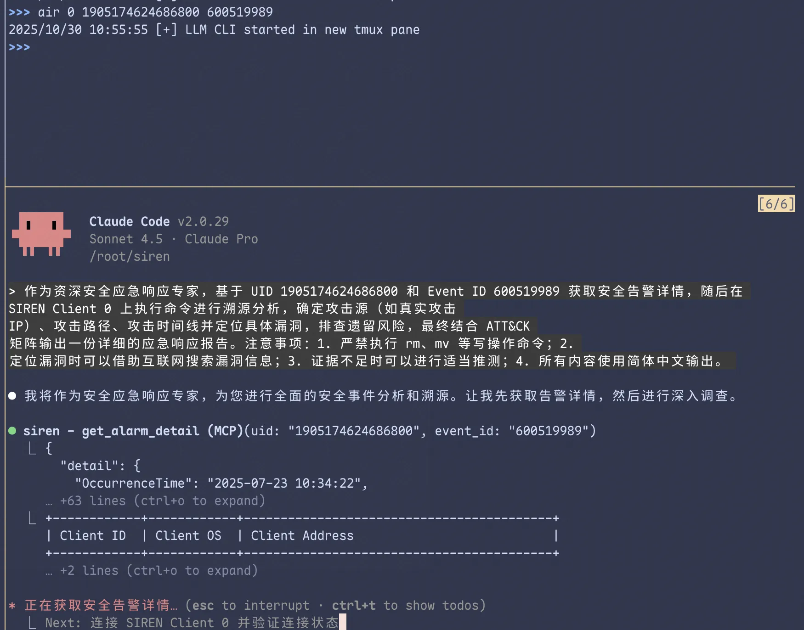

import { Accordion, Accordions } from "fumadocs-ui/components/accordion";
import { Banner } from 'fumadocs-ui/components/banner';
import { Callout } from "fumadocs-ui/components/callout";
import { Card, Cards } from "fumadocs-ui/components/card";
import { Step, Steps } from "fumadocs-ui/components/steps";

<Banner changeLayout={false} variant="rainbow" rainbowColors={['#60a5fa']}>仅远程模式支持</Banner>

Agentic 应急响应（AIR）让 AI Agent 自动化实施完整的应急响应流程——从获取安全告警详情、在受害主机上执行排查命令，到生成结构化的应急响应报告，全程无需人工干预。

<Callout title="前置条件" type="warn">
  使用前需确保：
  - 已在服务端配置文件中设置 `air.cliPath`（大模型 CLI 工具路径），详见[配置文件](/config#服务端配置)
  - 控制主机已安装 tmux
  - （仅告警事件模式）已设置 [SOAR 平台访问凭证](/credential#设置-soar-平台访问凭证)
</Callout>

## 使用方式

### 基于告警事件

当有明确的阿里云安全中心告警事件时，使用此模式：

```bash title="SIREN Server"
>>> air <Client ID> <Alibaba Cloud UID> <Security Center Event ID>
```

服务端会通过 tmux 启动一个新面板并自动运行配置的大模型 CLI（e.g. Claude Code）并提供预定义的 prompt 作为输入：



### 自定义 Prompt

当需要执行通用安全排查或自定义任务时，可直接提供 prompt：

```bash title="SIREN Server"
>>> air <Client ID> <Prompt>
```

用户提供的 prompt 会拼接到预定义的前缀（包含 Client ID 信息）后传递给大模型 CLI。

<Accordions>
  <Accordion title="示例">

```bash title="SIREN Server"
>>> air 0 检查是否存在后门或恶意进程
>>> air 0 分析最近 24 小时内的异常登录行为
>>> air 0 排查 Webshell 并生成报告
```

  </Accordion>
</Accordions>

<Callout title="提示" type="info">
  建议结合应急响应 Skills 使用，避免直接使用复杂的 prompt。
</Callout>

## 工作流

<Steps>
<Step>

### 获取告警详情

SIREN 通过 SOAR 平台获取指定安全告警的详细信息，包括告警类型、攻击源、受影响资产等。

</Step>
<Step>

### 启动 AI Agent

将告警信息和预定义 prompt 一起传递给配置的大模型 CLI（如 Claude Code），在 tmux 新面板中启动 Agent。

</Step>
<Step>

### 自动化排查

AI Agent 通过 [MCP 集成](/mcp) 自动调用 SIREN 提供的工具，在受害主机上执行信息收集与分析命令——进程排查、网络连接分析、文件完整性检查、日志审计等。

</Step>
<Step>

### 生成报告

Agent 完成排查后，自动生成包含攻击时间线、影响评估、IOC 指标、修复建议等内容的完整应急响应报告。

报告效果详见 [示例报告](/air/example)。

</Step>
</Steps>

## 其他使用方式

除了通过 `air` 命令使用大模型 CLI 执行应急响应，也可以直接使用任意支持 MCP 的 AI 服务达到相同效果。

<Cards>
  <Card title="MCP 集成" href="/mcp">
    了解如何将 SIREN 接入任意 AI 助手
  </Card>
</Cards>
