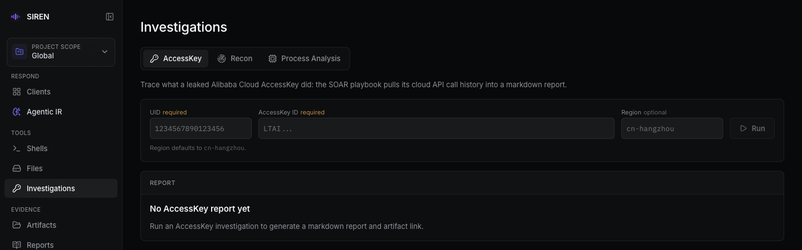

import { Banner } from 'fumadocs-ui/components/banner';
import { Accordion, Accordions } from "fumadocs-ui/components/accordion";
import { Callout } from "fumadocs-ui/components/callout";
import { Card, Cards } from "fumadocs-ui/components/card";

<Banner changeLayout={false} variant="rainbow" rainbowColors={['#60a5fa']}>仅远程模式支持</Banner>

发现泄露的云上 AccessKey 时，可以通过 SIREN 调用 SOAR 剧本查询它的云上调用历史，用于判断影响范围、确认可疑来源，并为止血和复盘提供证据。

<Callout title="前置条件" type="info">
  需要在控制主机上[设置 SOAR 平台访问凭证](/server/prerequisites#soar-凭证)。内部环境通常已预置。
</Callout>

## WebUI

1. 打开 [Web 控制台](/webui#investigations) 的 **Investigations** 页面。
2. 在 **AccessKey** 表单中填写 Alibaba Cloud UID、AccessKey ID 和可选的 Region，点击 **Run**。
3. 完成后点击 **Open Report** 在 Artifacts 中查看 Markdown 报告；失败时显示错误信息。



## 服务端 REPL

```bash
>>> ak <Alibaba Cloud UID> <AccessKey ID> [Region]
```

`Region` 留空时默认 `cn-hangzhou`，需要时填 `cn-beijing` 这类区域 ID（WebUI 同理）。

<Accordions>
  <Accordion title="示例输出">

```bash title="SIREN Server"
>>> ak 1601097845544644 LTAI1234567890123456
[*] Investigating AccessKey...
[+] Investigation completed. Report saved to: AK_1601097845544644_LTAI1234567890123456_2026-01-15_14-30-25.md
```

  </Accordion>
</Accordions>

## 输出位置

报告文件名形如 `AK_<UID>_<AccessKey ID>_<YYYY-MM-DD_HH-MM-SS>.md`，包含 SOAR 返回的调用历史，常见字段有调用时间、操作类型和来源 IP，以 SOAR 实际返回为准。

AccessKey 调查不绑定客户端，也不跟随 Project 视图：报告始终写入 Global Artifacts（`siren_server` 当前工作目录），在 Project 视图中发起时 **Open Report** 也会打开 Global 中的报告。

<Callout title="敏感信息" type="warn">
  报告包含 AccessKey ID 和调用历史。下载、转发或写入应急报告前，先确认接收范围和脱敏要求。
</Callout>

## 相关内容

<Cards>
  <Card title="Artifacts" href="/artifacts">
    查看服务端工作目录中的 Markdown 调查报告
  </Card>
  <Card title="凭证设置" href="/server/prerequisites#soar-凭证">
    配置 SOAR 平台访问凭证
  </Card>
</Cards>
