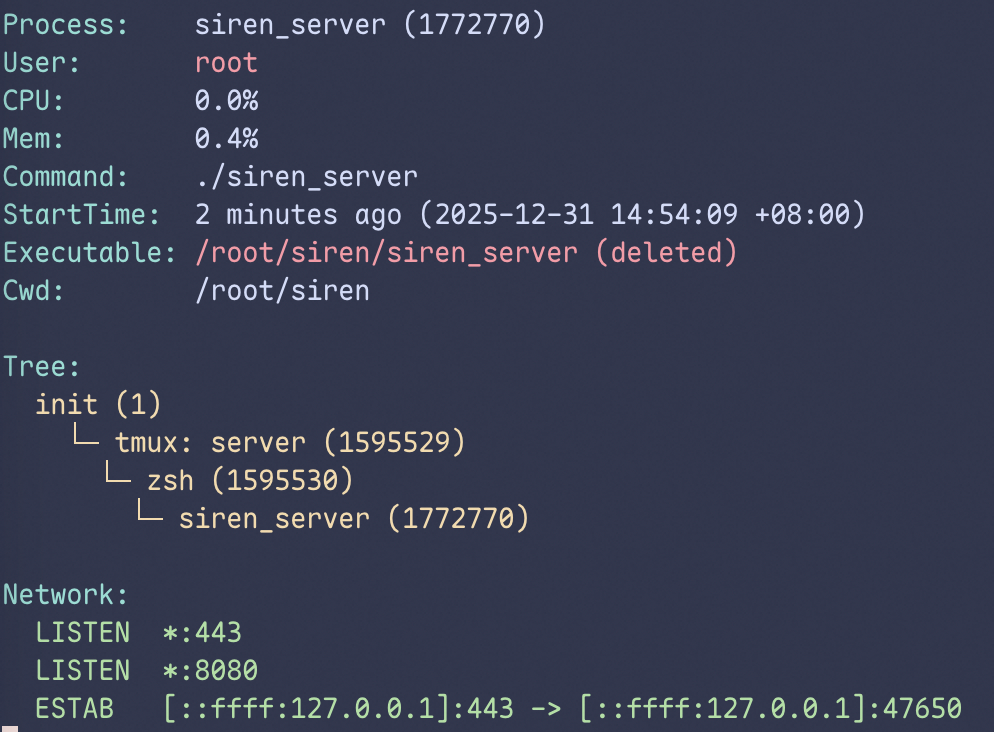

import { Banner } from 'fumadocs-ui/components/banner';
import { Callout } from "fumadocs-ui/components/callout";

<Banner changeLayout={false} variant="rainbow" rainbowColors={['#60a5fa']}>仅 Linux 平台支持</Banner>

基于进程 PID、监听端口或进程名称，快速获取进程详细信息，包括：

- **进程详情** — PID、PPID、用户、CPU/内存占用、命令行参数、可执行文件路径、工作目录、启动时间
- **进程树** — 从当前进程到 PID 1 的完整祖先链
- **容器检测** — 自动识别 Docker / containerd / podman 容器环境
- **网络连接** — TCP/UDP 连接列表，按状态排序（LISTEN 优先）
- **服务信息** — 关联的 systemd 服务名称、状态、Unit 文件路径



## 查询方式

进程分析支持三种查询方式，可根据已知信息灵活选择。

### 按 PID 查询

```bash tab="本地模式"
./siren info <PID>
```

```bash tab="远程模式"
>>> info <Client ID> <PID>
```

### 按监听端口查询

当你知道目标进程监听的端口号时：

```bash tab="本地模式"
./siren info -p <Port>
```

```bash tab="远程模式"
>>> info <Client ID> -p <Port>
```

### 按进程名称查询

支持模糊匹配，适合不确定 PID 时使用：

```bash tab="本地模式"
./siren info -n <Process Name>
```

```bash tab="远程模式"
>>> info <Client ID> -n <Process Name>
```

<Callout title="提示" type="info">
  当通过端口或名称匹配到多个进程时，会返回所有匹配进程的信息。
</Callout>
