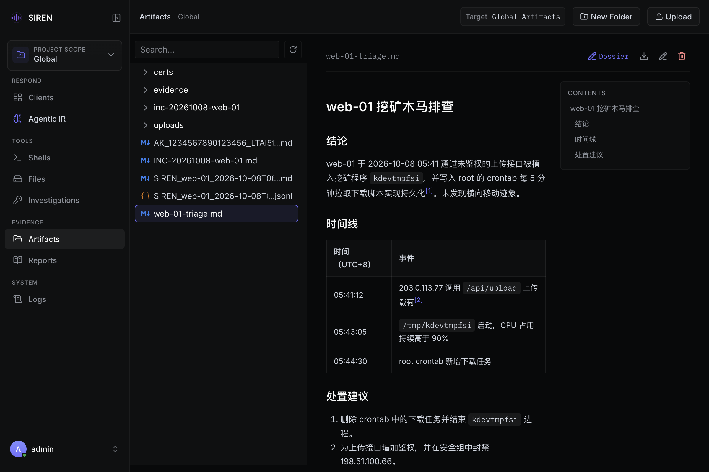

import { Callout } from "fumadocs-ui/components/callout";
import { Accordion, Accordions } from "fumadocs-ui/components/accordion";

Artifacts 页管理服务端上的证据目录：Recon 快照、AccessKey 报告、AIR 产出和手工上传的文件都在这里预览、下载、上传和整理。

## 根目录

根目录随页面顶部显示的当前范围（**Global** 或 Project 名称）变化：

| 范围 | 根目录 |
| --- | --- |
| Global | `siren_server` 进程的当前工作目录 |
| Project | 该 Project 的目录，见 [Projects](/projects#基准目录) |

`webui.projectsBaseDir` 留空时，Project 目录建在服务端工作目录下，在 Global 视图中也能看到。

<Callout title="Global 根目录就是服务端工作目录" type="warn">
  任何已登录账号都能在 Global 视图中下载、上传、重命名和删除服务端工作目录下的文件。除受保护的[服务端自身文件](#服务端自身文件)外，其他文件都会列出，不要在这里存放与调查无关的敏感文件。账号权限见 [账号的权限范围](/server/security#账号的权限范围)。
</Callout>

## 文件从哪里来

| 来源 | 文件 | 写入位置 |
| --- | --- | --- |
| [Recon](/recon) | `SIREN_<主机名>_<时间戳>_client-<ID>_req-<请求号>.recon.jsonl`（权威快照）和同名 `.md` | 客户端所属 Project 的根目录，未归属时为 Global；与当前视图无关 |
| [AccessKey 调查](/ak) | `AK_<UID>_<AccessKey ID>_<时间>.md` | 始终为 Global |
| [Agentic IR](/air/evidence#报告存放位置) | Agent 生成的报告和 `evidence/` 目录 | 启动会话时所在范围的根目录 |
| 服务端 REPL `upload` | `uploads/client-<Client ID>/<文件名>`，同名时依次存为 `<文件名>.1`、`<文件名>.2` | 始终为 Global，即使客户端已归属 Project |
| Dossier 粘贴图片 | `<报告名>.assets/pasted/paste-<时间>-<序号>.<扩展名>` | 报告所在目录，见 [报告](/reports#粘贴图片) |
| Artifacts 页 **Upload** | 上传的文件 | 页面顶部 **Target** 所示目录 |

Recon、AccessKey 调查和 AIR 完成后的 **Open Report** / **Preview** 会直接跳到 Artifacts 并选中对应文件。

## 浏览与预览

左侧是文件树，上方 **Search...** 按名称过滤，刷新按钮重新读取目录；点击文件在右侧预览：

- **文本**：5 MiB 以内直接显示。二进制文件显示 `Preview not supported for binary files`，下载后查看。
- **Markdown**：`.md`、`.markdown` 渲染显示，有两个以上一至三级标题时显示 **Contents** 目录。报告中的相对链接在 Artifacts 中打开目标文件，见 [链接如何打开](/air/evidence#链接如何打开)。
- **图片**：PNG、JPEG、GIF、WebP 显示尺寸，默认 **Fit**，可切到 **100%**，或按 25% 步长在 25% 到 400% 之间缩放。

HTML 报告不在页面中渲染，下载后用浏览器打开。



## 文件操作

右键文件树中的文件或目录可选 **Download**、**Rename**、**Delete**；选中文件后预览区右上角也有这三个按钮。

| 操作 | 说明 |
| --- | --- |
| **Download** | 单个文件不超过 100 MiB。目录打包为 `<目录名>.tar.gz`，排除点号开头的文件和子目录，内容合计不超过 100 MiB |
| **Upload** | 点 **Upload** 选择文件或拖到页面任意位置，逐个上传到 **Target**。单文件不超过 100 MiB，不支持目录。遇到同名文件时逐个弹出 **Overwrite existing artifact?**，选择 **Overwrite file** 或 **Skip file** |
| **New Folder** | 在 **Target** 下新建目录，**Target** 随即切到新目录 |
| **Rename** | 只改名称，不能移动目录。目标名称已存在时报错，不覆盖 |
| **Delete** | 删除文件，或递归删除目录及全部内容。需确认，删除后无法从 WebUI 恢复 |

**Target** 默认是根目录（显示为 `Global Artifacts` 或 `<Project> Artifacts`）。在文件树中点开某个目录即成为新的 **Target** 并标出 `Target`；切换范围后回到根目录。

<Callout title="操作的是服务端真实文件" type="warn">
  覆盖、重命名和删除直接作用于控制主机上的文件。执行前确认页面顶部的范围和目标路径。
</Callout>

## 路径限制

- **隐藏路径**：以 `.` 开头的文件和目录（如 `.env`、`.ssh`）不列出，也不能按路径访问；上传、新建目录和重命名时也不能用 `.` 开头的名称。
- **范围边界**：路径限制在当前根目录内，含 `..` 的路径和绝对路径被拒绝。符号链接只有解析后仍在根目录内才能读取；重命名和删除不作用于符号链接本身。
- **上传覆盖**：只替换普通文件，同名目标是目录或符号链接时报错。

### 服务端自身文件

服务端状态文件与 Global Artifacts 共用工作目录。以下路径不出现在文件树中，也不能预览、下载、上传覆盖、重命名或删除；解析符号链接后指向它们的路径同样被拒绝：

| 路径 | 默认位置 |
| --- | --- |
| 状态目录（Project 列表、客户端 ID、出站记录等） | `data/` |
| 账号库 | `webui.userDBPath`，默认 `data/users.db` |
| TLS 证书和私钥 | `cert`、`key` 配置项指向的文件 |
| 服务端配置文件 | 实际加载的 `server_config.yaml` |
| 服务端程序 | 正在运行的 `siren_server` 可执行文件 |

包含这些路径的目录（如存放证书的 `certs/`）仍会列出，其中其他文件可正常访问，但整个目录不能打包下载、重命名或删除。

## 在 Dossier 中编辑

选中 `.md` 文件后，预览区右上角的 **Dossier** 按钮在新标签页用 Dossier 打开编辑，保存直接写回该文件（Project 视图下即该 Project 目录中的文件）。`.markdown` 文件没有 **Dossier** 按钮。Dossier 不可用时按钮会提示原因，部署见 [部署 Dossier](/server/dossier)，编辑、粘贴图片和导出见 [报告](/reports)。

## 分享链接

选中文件后，地址栏会更新为指向该文件的链接：

```text
https://siren.example.com/#/artifacts/evidence/20261008-1430-ps-a1b2.txt?project=<Project ID>
```

Global 范围的文件没有 `?project=`。其他操作员登录后打开链接，WebUI 会切换到对应范围并选中该文件。

## 常见问题

<Accordions>
<Accordion title="找不到刚生成的文件">
点击文件树上方的刷新按钮，并确认页面顶部的范围：Recon 结果跟随客户端的 Project 归属，AccessKey 报告和 REPL `upload` 始终在 Global。
</Accordion>
<Accordion title="点击 Download 没有反应">
通常是文件超过 100 MiB，或目录内普通文件合计超过 100 MiB。页面不提示，错误只出现在浏览器开发者工具的控制台。改为分别下载子目录或单个文件，或直接在控制主机上打包。
</Accordion>
<Accordion title="重命名提示已存在">
同一目录下已有同名文件或目录，Rename 不覆盖，先处理同名对象再重试。
</Accordion>
<Accordion title="上传或新建时报 hidden filenames not allowed">
名称以 `.` 开头，Artifacts 不允许创建隐藏文件或目录，换一个名称。
</Accordion>
</Accordions>

## 命令行

服务端 REPL 没有浏览 Artifacts 的命令，可直接在控制主机上查看上述目录。从在线客户端拉取文件用 REPL 的 `upload <Client ID> <文件路径>`，见 [Files](/files#命令行)。
