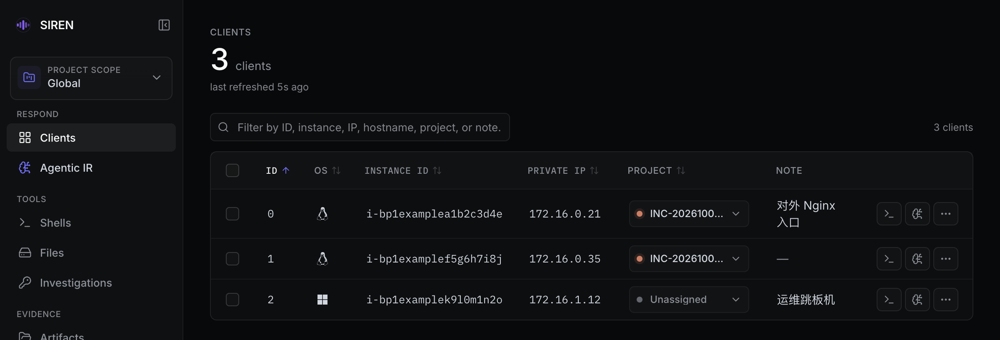

import { Callout } from "fumadocs-ui/components/callout";

Clients 页（`#/clients`）是 WebUI 的默认首页，列出当前范围内所有在线客户端。Shell、AIR、文件、Recon、进程分析和清理都可以从客户端行直接发起。

还没有客户端接入时，先看 [选择接入方式](/onboard)。

## 页面结构

从上到下依次是：

1. **页头**：在线客户端数量、距上次刷新的时间；处于 Project 视图时还显示 Project 名称。
2. **工具栏**：筛选框和计数；勾选客户端后变为批量操作栏。
3. **客户端表格**。
4. **Provisioning** 面板：部署客户端和放行网络，见下文 [Provisioning](#provisioning)。
5. **Recent activity**：近期部署和清理记录。

## 表格列

| 列 | 内容 |
| --- | --- |
| 勾选框 | 用于批量操作。表头的勾选框只选中当前筛选后可见的行 |
| **ID** | Client ID。重连和服务端重启后不变，含义见 [核心概念](/concepts#siren-server-与-client) |
| **OS** | 操作系统图标 |
| **Instance ID** | 阿里云 ECS 实例 ID；客户端没有上报时显示主机名 |
| **Private IP** | 第一个内网 IP，有多个时附 `+N` |
| **Project** | 所属 Project 及颜色标记，未归属显示 **Unassigned**。只有 Global 范围下是可编辑的下拉框 |
| **Note** | 客户端备注，点击编辑 |
| 操作 | Shell 图标、AIR 图标和 **More actions** 菜单 |

鼠标悬停或键盘聚焦 **Instance ID** 单元格会弹出主机卡片，显示 **Hostname**、**Version**、**Address**（客户端连接地址）和全部 **Private IP**。客户端没有上报版本时，**Version** 显示 **Not reported**。

## 筛选与排序

筛选框提示为 "Filter by ID, instance, IP, hostname, project, or note…"。输入内容按子串匹配 Client ID、OS、连接地址、Note、Project 名、主机名、Instance ID 和全部内网 IP，不区分大小写。工具栏右侧显示 `N of M`。

点击 **ID**、**OS**、**Instance ID**、**Private IP** 或 **Project** 列头排序，再次点击切换升降序；**Note** 列不能排序。默认按 ID 升序。按 Instance ID 或 Private IP 排序时，空值始终排在最后；内网 IP 按数值顺序比较。

窗口宽度不超过 768px 时，表格改为卡片布局，排序改用 **Sort** 下拉框，批量勾选改用 **Select visible (N)** 按钮。

## 刷新

列表按 **Settings** 中 **Client list refresh** 设置的间隔轮询，可选 5、10、30 或 60 秒，默认 10 秒。该设置只保存在当前浏览器。浏览器标签页切到后台时暂停轮询，切回时立即刷新；部署结束后也会立即刷新一次。

连续 3 次刷新失败时，表格上方显示 `Unable to reach server`。

## 编辑 Note

1. 点击客户端行的 **Note** 单元格。
2. 输入备注，最多 256 个字符，首尾空格会被去掉。
3. 按 Enter 或让输入框失去焦点即保存；按 Esc 放弃修改。清空内容并保存即删除备注。

保存失败时提示 "Couldn't save note. Press Enter to retry."，可以直接再按 Enter 重试。

Note 按客户端的稳定身份保存，客户端重连或服务端重启后仍在。它还会用在这些地方：

- 各页面的客户端选择器优先显示 Note，没有 Note 时依次显示 Instance ID、主机名。
- Shell 和 AIR 标签名。
- MCP `ls` 的输出，AIR 也能看到。

## 行内操作

| 入口 | 结果 |
| --- | --- |
| Shell 图标 | 新开一个浏览器 Shell 标签，并跳到 [Shells](/shells) |
| AIR 图标 | 跳到 [Agentic IR](/air)，切换到 **Custom** 模式并选中该客户端 |
| **More actions** → **Files** | 跳到 [Files](/files)，并选中该客户端 |
| **More actions** → **Recon** | 跳到 Investigations 的 Recon 标签并选中该客户端；选择 Profile 后点 **Start Recon** 才开始执行，见 [Recon](/recon) |
| **More actions** → **Process analysis** | 跳到 Investigations 的 Process Analysis 标签并选中该客户端，见 [进程分析](/process)。非 Linux 客户端显示为不可用的 **Process analysis (Linux only)** |
| **More actions** → **Clean & terminate** | 打开 **Clean & Terminate** 确认框，输入该客户端的 ID 后点 **Send cleanup request** |

**Clean & terminate** 让客户端删除 SIREN 管理的文件并退出，服务端无法确认最终删除结果。清理范围和结果状态见 [痕迹清除](/cleanup)。

## 批量操作

勾选一个或多个客户端后，工具栏变为批量操作栏：

- **N selected**：已选数量。部分已选客户端被当前筛选隐藏时，追加 `· M hidden by filter`，并出现 **Clear hidden** 按钮，用于只取消这些隐藏项。
- **Assign project**：仅在 Global 范围显示。选择一个 Project 或 **Unassigned** 后立即生效，不再确认。
- **Clean N**：打开确认框，列出全部目标，并提示其中有几个被筛选隐藏。输入选中数量后点 **Send N requests**。
- **Clear all**：取消全部勾选。

批量操作作用于全部已选客户端，包括被筛选隐藏的。执行前先确认隐藏项。

## 分配 Project

在 Global 范围，用 **Project** 列下拉框分配单个客户端，或用批量 **Assign project**。进入 Project 视图后 **Project** 列只读，未归属的客户端也不再显示。Project 的完整规则见 [Project 范围](/projects)。

## 空状态

没有在线客户端时，表格位置显示 **No connected clients** 和三步引导：

1. **Deploy a client**：用下方 Provisioning 的 **Deploy SIREN**，或在主机上运行 `./siren client -s <server> -p <port>`，见 [手动安装客户端](/onboard/manual)。
2. **Wait for it to connect**：列表会自动刷新，客户端连上后出现新行。
3. **Pick a client and start**：从客户端行开始操作。

筛选后没有匹配项时显示 **No clients match the filter**，清空筛选框即可。

## Provisioning

表格下方的 **Provisioning** 面板通过 SOAR 操作阿里云 ECS，有四个标签：**Allow access**、**Configure egress**、**Restore egress** 和 **Deploy SIREN**，默认打开 **Deploy SIREN**。在 Project 视图中部署的客户端会自动归属当前 Project。

具体用法分别见：

- [一键部署](/onboard/provisioning)：**Deploy SIREN**、**Allow access**、失败重试
- [出站放行](/onboard/egress)：**Configure egress**
- [恢复出站规则](/restore-egress)：**Restore egress**

## Recent activity

**Recent activity** 把近期的部署（Deploy）和清理（Cleanup）记录合并成一个列表：

- Global 显示全部记录，Project 视图只显示该 Project 的记录。进行中的记录排在最前，其余按时间倒序。
- 默认显示 5 条，点 **Show all N** 展开全部。右侧按钮可以折叠整个区域，折叠状态保存在当前浏览器。
- 部署记录可以点开查看逐步日志，刷新页面后进行中的部署仍可在这里继续查看。

部署结果不确定时，先在这里核对，再决定是否重试，见 [一键部署](/onboard/provisioning)。清理记录的状态含义见 [痕迹清除](/cleanup)。

## 常见问题

**客户端在运行，列表里却没有它**

- 确认当前范围。未归属的客户端只在 Global 显示，归属其他 Project 的客户端也不会出现在当前 Project 视图。
- 清空筛选框。
- 确认客户端确实已连上服务端，可在 [Logs](/logs) 中查看接入失败的记录。

**重新部署后 Note 和 Project 没了**

**Clean & terminate** 会删除客户端的稳定身份。重新部署的客户端是新身份、新 Client ID，需要重新填写 Note 和分配 Project。

**Process analysis 是灰的**

进程分析只支持 Linux 客户端。

<Callout title="命令行等价" type="info">
  服务端 REPL 的 `ls`、`note <Client ID> [Note]` 和 `clean <Client ID>` 分别对应列出客户端、设置备注和清理。REPL 没有 Project 范围，`ls` 总是列出全部客户端，也不能分配 Project。见 [服务端 REPL](/reference/repl)。
</Callout>
