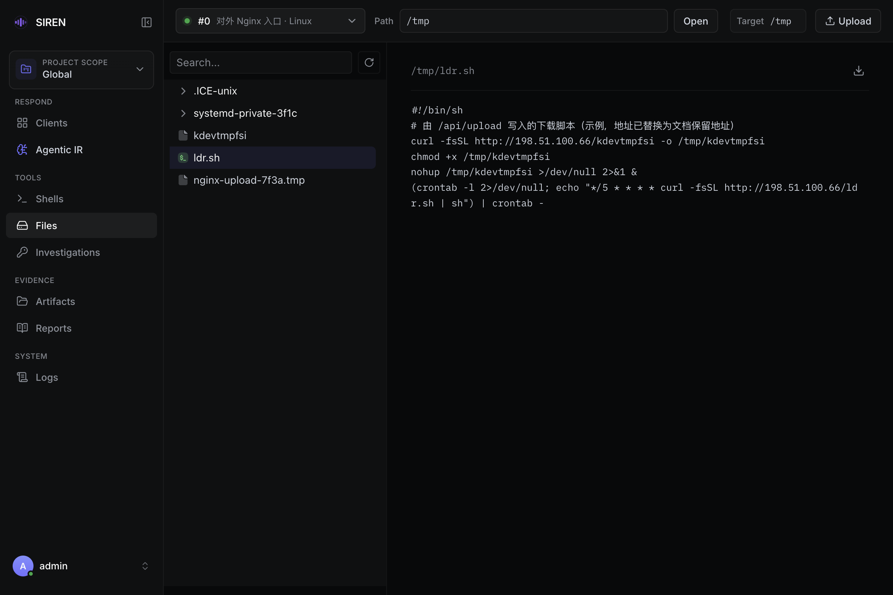

import { Callout } from "fumadocs-ui/components/callout";

**Files** 页面直接读写在线客户端主机的文件系统：浏览目录、预览文本、下载文件或目录、上传文件。服务端上的报告和取证文件在 [Artifacts](/artifacts) 中管理。

## 打开方式

- 侧栏 **Files**，在左上角下拉框中选择客户端。下拉框只列出当前范围内的在线客户端。
- [Clients](/clients#行内操作) 页客户端行的 **More actions** → **Files**，预选这台客户端。

## 浏览目录

左侧文件树从根目录开始：Linux 和 macOS 为 `/`，Windows 为 `C:\`。

- **Path**：输入路径后按 Enter 或点 **Open**，文件树改从该路径开始。留空表示 `.`，即客户端进程的工作目录，相对路径也相对于它。
- 搜索框（**Search...**）只在已载入的条目中按名称筛选，不搜索未展开的目录。
- 隐藏文件照常显示。

每个目录最多列出 1,000 个条目，超出时显示 `Showing first 1000 entries`。截取按客户端读取顺序进行，省略的不一定是排序后的最后几项；完整内容请在 [Shell](/shells) 中用 `ls` 或 `find` 查看。

## 预览

| 文件 | 预览方式 |
| --- | --- |
| 文本文件，不超过 5 MiB | 原样显示 |
| `.md`、`.markdown` | 渲染为 Markdown |
| 二进制文件（含图片） | 显示 `Preview not supported for binary files`，请下载查看 |
| 超过 5 MiB 的文本 | 报错 `file too large for preview`，请下载查看 |



## 下载

- 文件：点预览区的 **Download**，或在文件树中右键选择 **Download**。
- 目录：右键目录选择 **Download**，客户端打包为 `<目录名>.tar.gz`；根目录 `/` 为 `root.tar.gz`。

单个文件上限 100 MiB；目录中普通文件合计和压缩包本身都不能超过 100 MiB，否则报错 `directory too large for download`。打包时隐藏文件照常包含，符号链接、设备文件等非普通文件和无权读取的文件被静默跳过。

下载只保存到浏览器，不进入服务端 Artifacts；需要在服务端留存，用下文 [命令行](#命令行) 的 REPL `upload`，或把文件上传到 [Artifacts](/artifacts)。

每次读取、下载或上传最多等待客户端 2 分钟。

## 上传

页面右上角的 **Target** 是上传目标：打开某个路径后为该路径；在文件树中展开某个目录后变为该目录。

1. 确认客户端和 **Target**。
2. 点击 **Upload** 选择一个或多个文件，或把文件拖到页面任意位置。
3. 遇到同名文件时弹出 **Overwrite client file?**，逐个选择 **Overwrite file** 或 **Skip file**。

| 规则 | 说明 |
| --- | --- |
| 单文件上限 | 100 MiB，超出的计为失败，其余继续上传 |
| 目录 | 不支持，拖入目录时提示 `Directory upload is not supported. Drop files only.` |
| 文件名 | 不能包含 `/` 或 `\` |
| 新文件权限 | Linux 和 macOS 上为 `0644`；覆盖时保留原权限 |

<Callout title="直接修改客户端主机" type="warn">
  上传和覆盖会立即改写客户端主机上的文件，无法从 WebUI 撤销。操作前确认客户端、范围和 Target 目录。
</Callout>

## Files 不能做的事

Files 不提供删除、重命名、新建目录或修改权限，请在 [Shell](/shells) 中执行。

## 命令行

```bash tab="服务端 REPL"
>>> upload <Client ID> <Client file path>
```

```bash tab="本地模式"
./siren upload <file path>
```

**服务端 REPL** 的 `upload` 从在线客户端拉取一个文件到服务端：

- 保存到服务端工作目录下的 `uploads/client-<Client ID>/<文件名>`，即 Global Artifacts；客户端属于 Project 时也不进入 Project 目录。
- 不覆盖同名文件，依次保存为 `<文件名>.1`、`<文件名>.2`……
- 只能拉取普通文件，单个最大 1 GiB，路径可以含空格（如 `C:\Program Files\...`）。
- 保存成功后，[Logs](/logs) 中出现带保存路径的 `artifact.upload.saved` 事件。

**本地模式** 的 `./siren upload` 把当前主机上的文件上传到阿里云 OSS 的 `<oss.objectPath>/<文件名>`（安装包配置的前缀为 `tmp/siren_upload`），桶和地域由 `oss.bucketName`、`oss.region` 决定，见 [客户端配置](/reference/client-config)。使用前需在该主机上设置 [OSS 凭证](/server/prerequisites#oss-凭证)。
