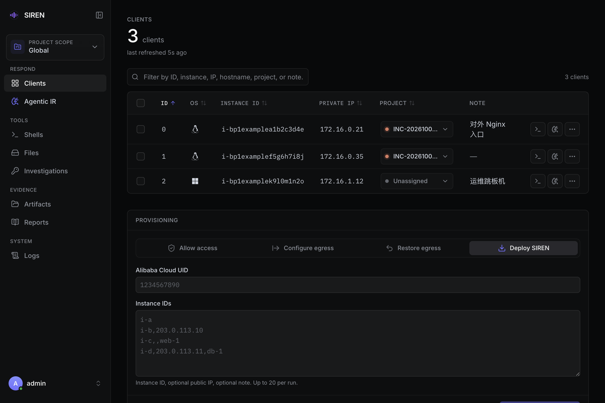

import { Callout } from "fumadocs-ui/components/callout";
import { Card, Cards } from "fumadocs-ui/components/card";
import { Step, Steps } from "fumadocs-ui/components/steps";
import { Server, Workflow } from 'lucide-react';

## 四步完成第一次排查

<Callout title="内部预部署环境" type="info">
  内部环境通常已配好控制主机、SOAR 凭证和外部工具，可直接从第 2 步开始；内部地址见 [内部文档](https://aliyuque.antfin.com/ykozrq/puiz2d/mktg38agsx5bfz9v)。
</Callout>

<Steps>
<Step>

### 部署服务端

在控制主机上用 root 运行安装脚本，创建 Web 控制台账号，并把 MCP 管理凭证写入 `.env`：

```bash title="控制主机"
curl -fsSL https://oss-siren.oss-cn-hongkong.aliyuncs.com/get_siren_server.sh | sh
cd /opt/siren
./siren_server user add admin
umask 077
cat > .env <<EOF
SIREN_MCP_ADMIN_TOKEN=$(openssl rand -hex 32)
EOF
```

然后在 tmux 中启动服务端（终端关闭时服务端会退出，不能直接交给 systemd）：

```bash title="控制主机"
tmux new -s siren
cd /opt/siren && ./siren_server
```

默认启用 MCP，缺少 `SIREN_MCP_ADMIN_TOKEN` 时服务端拒绝启动。证书、`webui.publicURL`、`egress.rules` 和各项依赖见 [安装服务端](/server) 与 [前置条件与凭证](/server/prerequisites)。

</Step>
<Step>

### 登录 Web 控制台

浏览器打开 `https://<SIREN Server 域名>`，用刚创建的账号登录。见 [WebUI 导览](/webui)。



需要按事件隔离主机和取证文件时，先在侧栏顶部的范围菜单中创建并切换到一个 [Project](/projects)，之后接入的主机会自动归属到它。

</Step>
<Step>

### 接入第一台主机

在 **Clients** 页的 **Provisioning** 区域选择接入方式：

- **阿里云 ECS**：选择 **Deploy SIREN**，填写 Alibaba Cloud UID 和 Instance ID（每行一个）。SIREN 通过云助手安装客户端并放行网络。见 [一键部署](/onboard/provisioning)。
- **其他主机**：先用 **Allow access** 放行目标主机的公网出口 IP，再登录目标主机运行安装脚本并启动客户端。见 [手动安装客户端](/onboard/manual)。

客户端连接后出现在 Clients 列表中。见 [选择接入方式](/onboard)。

</Step>
<Step>

### 开始排查

- 在客户端行菜单选择 **Recon**，选好 Profile 后点击 **Start Recon** 收集系统基线快照。见 [Recon](/recon)。
- 进入 **Agentic IR**，选择 Provider 和 **Event** 模式，填写 UID 与告警 ID 后启动，让 Agent 通过 SIREN 工具排查。见 [Agentic 应急响应](/air)。
- 进入 **Shells** 打开交互式终端，或在 **Files** 中浏览和下载可疑文件。

结果保存在 **Artifacts** 中。结束后按 [痕迹清除](/cleanup) 和 [恢复出站规则](/restore-egress) 收尾。

</Step>
</Steps>

## 本地模式

目标主机无法连接控制主机，或要求数据不离开主机时，可以不用服务端，直接在目标主机上运行 Recon：

```bash tab="Linux"
curl -fsSL https://oss-siren.oss-cn-hongkong.aliyuncs.com/get_siren.sh | sh
cd /opt/siren
./siren recon
```

```powershell tab="Windows"
iwr -Uri 'https://oss-siren.oss-cn-hongkong.aliyuncs.com/get_siren.ps1' -UseBasicParsing | iex
Set-Location C:\Windows\Temp\siren
.\siren.exe recon
```

本地模式只有 Recon、进程分析、上传和清理等客户端命令，没有 Web 控制台、Shell、Agentic IR 和 Project。见 [Recon](/recon)。

## 下一步

<Cards>
  <Card title="安装服务端" href="/server" icon={<Server />}>
    证书、域名、常驻运行与升级
  </Card>
  <Card title="核心概念" href="/concepts" icon={<Workflow />}>
    Client、Project、Artifacts、Reports 等概念的关系
  </Card>
</Cards>
