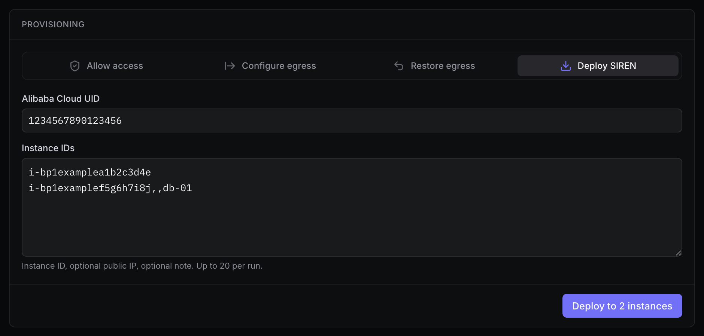

import { Callout } from "fumadocs-ui/components/callout";
import { Steps, Step } from "fumadocs-ui/components/steps";

**Deploy SIREN** 通过 SOAR 剧本和阿里云云助手向 ECS 安装 SIREN 客户端、放行其回连 IP，并等待客户端实际连上服务端。入口是 Clients 页 **Provisioning** 面板的 **Deploy SIREN** 标签。

## 前置条件

- 目标是阿里云 ECS，云助手状态正常；已知其所属账号的 Alibaba Cloud UID。
- 服务端已配置 SOAR 访问凭证与 `egress.rules`，见 [前置条件与凭证](/server/prerequisites)。
- `egress.rules` 中 `siren_server_callback` 规则的 `destCidrIp` 是服务端公网 IP，且只含这一个 IPv4 地址（`/32`）。部署时 SIREN 把该地址和端口写入目标主机客户端的 `config.yaml` 供回连，因此自建服务端也能一键部署。不满足时部署直接失败：`SIREN callback must configure exactly one server IP (destCidrIp ending in /32)`。

## 操作步骤

<Steps>
<Step>
在 Clients 页 **Provisioning** 面板选择 **Deploy SIREN** 标签。
</Step>
<Step>
填写 **Alibaba Cloud UID**（纯数字），在 **Instance IDs** 中每行填一个目标。
</Step>
<Step>
点击 **Deploy to N instances**。每个目标逐行显示 SOAR 日志与状态，全部结束后给出汇总。
</Step>
</Steps>



### 目标格式

每行格式为 `instanceId[,publicIp[,note]]`：

```text title="Instance IDs"
i-demo0001
i-demo0002,203.0.113.10
i-demo0003,,web-1
i-demo0004,203.0.113.11,db-1
```

- `instanceId` 必填，形如 `i-...`；公网 IP 可选，见 [手动指定出口 IP](#注意事项)；备注可选，最长 256 个字符。
- 每批 1–20 个目标，并发 3 台，单个失败不影响其他目标。完全相同的行自动去重；同一实例的公网 IP 或备注不一致时报错。

## 部署流程

未手动指定出口 IP 时，每个目标依次经过：

1. **安装与探测**：读取实例地域和操作系统，安装客户端，抓取一个出站 SYN（最长约 4 秒）。
2. **等待日志**：等云防火墙日志唯一关联出该连接的公网出口 IP 后立即进入下一步；日志迟迟不到会超时失败。
3. **放行**：为该出口 IP 的 `/32` 和服务端回连端口添加入方向放行。
4. **等待连接**：等待客户端上线，最长 30 秒。

客户端实际连上才算成功，面板显示 `connected`。安装成功但未按时连上则以超时失败结束，并提示可能需要配置出站。

从 Project 视图发起的部署，客户端自动归入当前 Project；目标已归属另一个 Project 时部署被拒绝，见 [部署时自动归属](/projects#部署时自动归属)。

<Callout title="需要手工确认客户端" type="warn">
  客户端稳定身份缺失、与目标来源 IP 不一致，或多个目标共享出口 IP 而无法安全区分时，SIREN 不按 IP 猜测，也不写入无法确认的 Project 或备注。该目标显示 `manual_required`，需在 Clients 中核对主机后手动设置；面板不为它提供自动重试，以免重复部署。
</Callout>

## 结果与记录

- **重试**：存在失败目标时，**Retry N failed** 只重新提交失败项，沿用原 UID 和 Project；**Edit targets** 修改目标后重新开始。
- **出站问题**：失败明确指向出站时，面板出现 **Configure egress for N target(s)**，带入这些实例切到 [配置出站](/onboard/egress)。
- **Recent activity**：Provisioning 下方合并显示部署和清理记录，部署行可展开查看日志。近期部署最多保留 20 条，终态记录最长保留 30 分钟，服务端重启后清空。
- **刷新页面**：执行期间请保持页面打开；刷新后可从 Recent activity 继续查看，云端操作不因浏览器断开而取消。

<Callout title="结果未知时先看 Recent activity" type="warn">
  目标显示 **Needs verification**（如部署事件流中断）时，服务端可能仍在执行。不要直接重试，先在 Recent activity 核对最终结果再决定。
</Callout>

## 注意事项

- **出站默认拒绝**：目标 ECS 出方向默认拒绝时无法回连，先 [配置出站](/onboard/egress)。
- **动态出口**：单次探测只确认该次连接的出口 IP，后续连接换了公网地址仍可能连不上；SIREN 不会放行整个出口池。每次重试都重新探测。
- **手动指定出口 IP**：SOAR 无法返回出口 IP，或系统不支持自动抓包（如需要第三方抓包驱动的 Windows）时，在目标行第二列填入核对过的公网出口 IP（可在主机上用 `curl ifconfig.co/ip` 获取），SIREN 跳过自动发现直接放行。

<Callout title="命令行等价" type="info">
  服务端 REPL 的 `deploy-batch` 和 MCP `deploy` 工具走同一套部署流程，见 [服务端 REPL](/reference/repl) 和 [MCP 集成](/reference/mcp)。
</Callout>
