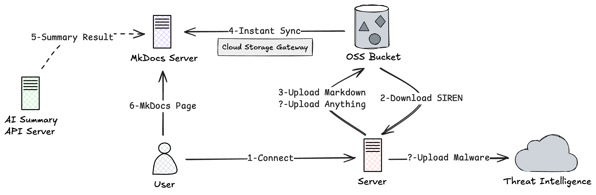
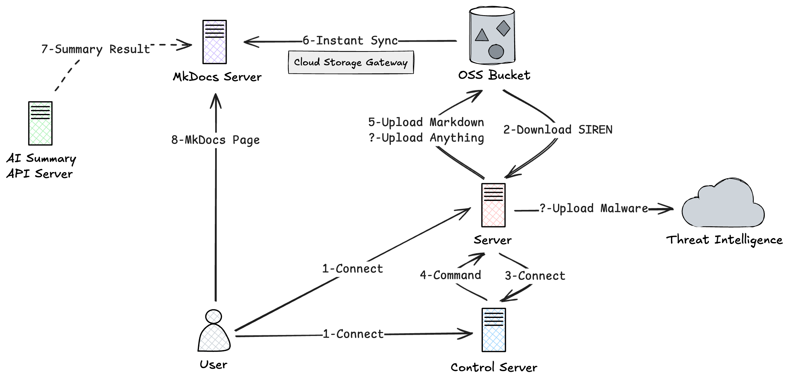

import { Card, Cards } from "fumadocs-ui/components/card";
import { Callout } from "fumadocs-ui/components/callout";
import { Search, Radio, Brain, Shield, Feather, FileText, Puzzle, FolderKanban, LayoutDashboard, BookOpenText } from 'lucide-react';

<Callout title="注意" type="warn">
  SIREN 仅面向合法的应急响应和安全分析场景。运行信息收集、远程 Shell、文件操作、端口转发或痕迹清除前，请确认你有权调查目标系统。
</Callout>

## 什么是 SIREN？

SIREN（**S**wift **I**ncident **R**esponse **E**vidence **N**avigator）是面向主机应急响应的工具。它把信息收集、远程操作、文件管理、AI 辅助排查和报告整理放到同一套工作流里，适合在事件处理中快速接入目标主机并留存证据。

SIREN 支持本地模式和远程模式。本地模式直接在目标主机上运行，适合离线单机排查；远程模式由 SIREN Server 管理在线客户端，提供服务端 REPL、Web 控制台、Artifacts、Projects、Agentic IR 和 MCP 服务。需要内部 SOAR 能力时，还可以放行、部署目标主机，或调查 AccessKey。

## 设计理念

<Cards>
  <Card title="单二进制部署" icon={<Feather />}>
    Go 静态编译客户端，减少目标主机上的运行时依赖
  </Card>
  <Card title="证据优先" icon={<FileText />}>
    Recon、Files、Artifacts 和 Dossier 都围绕证据收集、留存和报告交付展开
  </Card>
  <Card title="本地与远程并存" icon={<Radio />}>
    本地模式适合隔离环境；远程模式适合多客户端统一管理和远程排查
  </Card>
  <Card title="可扩展" icon={<Puzzle />}>
    插件系统扩展客户端能力，MCP 让 AI 助手接入 SIREN 工具
  </Card>
</Cards>

## 核心能力

<Cards>
  <Card title="信息收集" icon={<Search />} href="/recon">
    通过命名 Profile 采集系统、用户、进程、网络、计划任务、服务、文件、内核模块和应用配置，生成权威 JSONL 快照与派生 Markdown
  </Card>
  <Card title="远程操作" icon={<Radio />} href="/remote">
    通过 TLS 连接在线客户端，支持服务端 REPL、远程命令、交互式 Shell 和端口转发
  </Card>
  <Card title="Web 控制台" icon={<LayoutDashboard />} href="/webui">
    在浏览器中管理 Clients、Shells、Investigations、Files、Artifacts、Projects 和 Dossier
  </Card>
  <Card title="调查与分析" icon={<Shield />} href="/webui#investigations">
    执行 AccessKey 调查、客户端 Recon 和 Linux 进程分析，并跳转到 Artifacts 查看结果
  </Card>
  <Card title="Agentic IR 与 MCP" icon={<Brain />} href="/air">
    在 Web 控制台中启动 Claude / Codex / Qoder 会话，或在服务端 REPL 中启动 Claude 会话，并通过 MCP 使用 SIREN 工具
  </Card>
  <Card title="Projects 工作区" icon={<FolderKanban />} href="/webui#projects">
    按应急响应项目隔离客户端、操作目标、Artifacts 目录和 AIR 工作目录
  </Card>
  <Card title="文件与报告" icon={<BookOpenText />} href="/analysis/upload">
    管理客户端 Files、服务端 Artifacts 和 Dossier Markdown 应急报告
  </Card>
  <Card title="插件系统" icon={<Puzzle />} href="/plugins">
    安装和管理 command / recon 插件，扩展独立命令或信息收集模块
  </Card>
</Cards>

## 架构设计

### 本地模式

在目标主机上直接运行 `siren`。Recon 的 JSONL 与 Markdown 生成在本地；如配置 OSS，两份 artifact 都会上传。此模式不需要 SIREN Server，也不提供 Web 控制台、MCP 或远程 Shell。

### 远程模式

在控制主机运行 `siren_server`，目标主机运行 `siren client` 并通过 TLS 连接服务端。服务端负责客户端管理、命令下发、Artifacts 保存、Project 目录隔离、Web 控制台和 MCP 服务；Dossier、SOAR、OSS、Claude / Codex / Qoder CLI 等能力按需接入。

