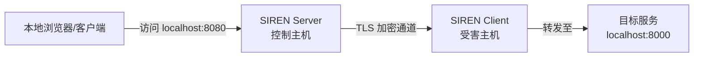

import { Banner } from 'fumadocs-ui/components/banner';
import { Callout } from "fumadocs-ui/components/callout";

<Banner changeLayout={false} variant="rainbow" rainbowColors={['#60a5fa']}>仅远程模式支持</Banner>

端口转发允许你通过控制主机访问受害主机内网中的服务。

**常见使用场景：**

- 访问受害主机上仅监听 `localhost` 的 Web 管理后台
- 连接受害主机内网中的数据库
- 排查受害主机上运行的内网服务

## 工作原理



## 启用端口转发

假设受害主机侧目标服务运行在 `localhost:8000`，期望通过控制主机的 `8080` 端口访问：

```bash title="SIREN Server"
>>> forward <Client ID> 8080:localhost:8000
```

或省略 `localhost`：

```bash title="SIREN Server"
>>> forward <Client ID> 8080:8000
```

此时访问控制主机 `8080` 端口的流量就会被转发到受害主机的 `localhost:8000`。

<Callout title="转发到其他主机" type="info">
  目标地址不限于 `localhost`，也可以转发到受害主机所在内网的其他主机，例如 `8080:192.168.1.10:3306`。
</Callout>

## 查看端口转发

```bash title="SIREN Server"
>>> lsforward
```

## 停止端口转发

```bash title="SIREN Server"
>>> stopforward <Client ID> <Forward ID>
```

其中 `Forward ID` 可通过 `lsforward` 查看。
