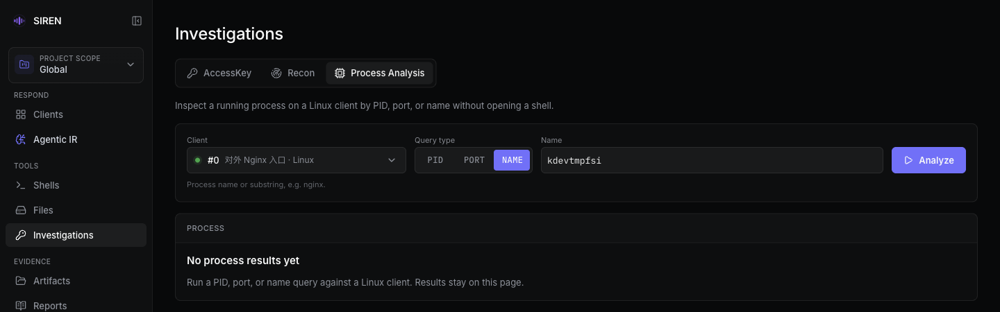

import { Callout } from "fumadocs-ui/components/callout";

进程分析不用打开 Shell，就能查看 Linux 客户端上某个进程的详情：父进程链、资源占用、命令行、可执行文件、网络连接、容器和 systemd 服务线索，并标出常见的可疑特征。它在 **Investigations** 页面的 **Process Analysis** 标签中（`#/investigations/process`）。

只支持 Linux 客户端。查询结果只显示在当前浏览器页面中，不会写入 Artifacts。

## 打开方式

- 侧栏 **Investigations** → **Process Analysis** 标签，再选择客户端。
- [Clients](/clients#行内操作) 页客户端行的 **More actions** → **Process analysis**：跳到该标签并选中这台客户端。非 Linux 客户端显示为不可用的 **Process analysis (Linux only)**。
- AIR 会话中的 **Security Center alerts** 结果卡：带进程 ID 的告警显示 **Inspect PID N**，点击后切换到该会话所在的 Project 或 Global 范围，选中告警主机对应的客户端，并把查询类型设为 **PID**、填入该 PID，见 [GUI 时间线](/air/gui#结构化结果卡)。这一步只预填表单，仍需点击 **Analyze**。该范围内必须恰好有一台匹配的在线 Linux 客户端，否则提示 `Process evidence needs one connected Linux client in the source workspace.`

## 查询步骤

1. 在 **Client** 中选择客户端。下拉框只列出当前范围内的 Linux 客户端；一台都没有时，表单下方提示 `No Linux clients are currently connected; process analysis needs a Linux client.`
2. 在 **Query type** 中选择 **PID**、**Port** 或 **Name**。
3. 填写查询值，点击 **Analyze**。格式不对时按钮不可用，并提示应填写的内容。

| 查询类型 | 填写 | 客户端如何定位进程 |
| --- | --- | --- |
| **PID** | 正整数 | 直接读取该 PID |
| **Port** | 1–65535 | 只查找处于 `LISTEN` 状态的 TCP 端口：先用 `ss -tlnp`，查不到再用 `lsof`，取找到的第一个 PID。UDP 端口和已建立的外联连接无法用端口反查 |
| **Name** | 进程名或其中一段 | 用 `pgrep` 匹配进程名，支持正则，但不匹配命令行参数。只匹配到一个进程时直接显示详情；匹配到多个时先列出候选，最多 50 个 |

Linux 记录的进程名最长 15 个字符，按名称查询时以这 15 个字符为准。要按命令行参数查找，先在 [Shell](/shells) 中用 `pgrep -af` 或 `ps` 找到 PID，再按 PID 查询。

每次查询最多等待客户端 30 秒，超时或客户端返回错误时，错误显示在结果区上方，已有的结果保留。



## 结果视图

结果区左侧是 **Candidates** 和 **History** 两栏，右侧是选中进程的详情。

- **Candidates**：按名称匹配到多个进程时，列出每个候选的 PID 和完整命令行；超过 50 个时提示 `Showing first 50 matches.`，请换更精确的名称。点击某个候选会按 PID 发起一次新查询，不会改动表单中的输入。
- **History**：已查看过的进程，最新的在最上面。点击条目切换右侧详情；存在红色风险标记的进程前面有红点。
- 每条结果都可以单独删除，**Clear** 清空全部结果。

页面最多保留最近 10 条结果；重复相同的查询会刷新原条目，不会重复堆叠。切换到其他 WebUI 页面再回来，结果仍在；刷新浏览器或切换 Project / Global 范围后清空。

### 进程详情

详情区从上到下依次是：

| 区块 | 内容 |
| --- | --- |
| 标题 | 进程名、PID、客户端、本次查询条件和查询时间，以及风险标记 |
| **Parent Chain** | 从最上层祖先进程到当前进程的完整父进程链，当前进程标为 `selected` |
| 概要 | **User**、**State**、**CPU**、**Memory**、**Start**。CPU 和内存超过 50% 显示为琥珀色，超过 80% 显示为红色 |
| 路径 | **CWD**（工作目录）、**Command**（完整命令行）、**Executable**（可执行文件路径） |
| **Network** | 该进程的 TCP / UDP 连接，按状态分组，例如 `LISTEN`、`ESTAB`；每行显示本地地址和远端地址，没有远端地址时显示 `local only` |
| **Container** | 从 cgroup 识别到的 Docker、containerd 或 podman 容器类型和 ID，Docker 容器还显示名称。客户端本身运行在无法识别的容器中时，类型显示为 `container`，ID 为 `unknown` |
| **Startup Source** | PID 1 是 systemd 且进程属于某个 systemd 服务时，显示服务名、状态、描述和 Unit 文件路径 |

没有对应信息的区块不显示。CPU 和内存占用取自 `ps`，其中 CPU 是进程整个生命周期内的平均值，不是瞬时值。

### 风险标记

| 标记 | 条件 | 颜色 |
| --- | --- | --- |
| `deleted executable` | 可执行文件路径以 ` (deleted)` 结尾，即磁盘上的程序文件已被删除 | 红 |
| `zombie` | 进程状态为 `Z` | 红 |
| `root` | 以 root 用户运行 | 琥珀 |
| `high CPU` | CPU 占用超过 50% | 琥珀 |
| `high memory` | 内存占用超过 50% | 琥珀 |

出现红色标记时，详情标题区也会以红色强调。这些只是排查线索，不代表进程一定恶意。

## 常见问题

**下拉框里没有目标客户端**

确认客户端是 Linux 且在线，并且属于当前 Project；未归属任何 Project 的客户端只在 Global 范围出现，见 [Project 范围](/projects)。

**按端口查不到进程**

端口查询只认 TCP `LISTEN`。确认端口确实在监听，并且客户端主机上有 `ss` 或 `lsof`。

**进程查到了，但 Network 或 Startup Source 是空的**

网络连接依赖客户端主机上的 `ss`（缺失时改用 `lsof`），服务信息依赖 `systemctl`。主机缺少这些工具或不是 systemd 系统时，对应区块不会出现。

## 命令行

服务端 REPL 和本地模式提供同样的查询，结果以彩色文本打印在终端中，root 用户、超过 50% 的 CPU / 内存、已删除的可执行文件和僵尸进程以红色显示。

```bash tab="服务端 REPL"
>>> info <Client ID> <PID>
>>> info <Client ID> -p <Port>
>>> info <Client ID> -n <Process Name>
```

```bash tab="本地模式"
./siren info <PID>
./siren info -p <Port>
./siren info -n <Process Name>
```

- REPL 的 `info` 不支持 Windows 客户端。名称匹配到多个进程时打印候选列表（最多 50 个），需要再用精确 PID 查询。REPL 用法见 [服务端 REPL](/reference/repl)。
- 本地模式的 `info` 只在 Linux 版客户端中提供，名称匹配的候选数量不设上限。
