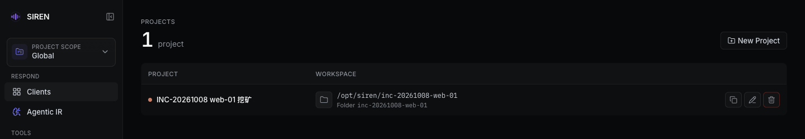

import { Callout } from "fumadocs-ui/components/callout";
import { Step, Steps } from "fumadocs-ui/components/steps";

Project 把一次事件涉及的客户端、AIR 会话和证据文件放进同一范围，并在服务端固定一个目录；不选 Project 时处于 **Global** 范围。概念见 [核心概念](/concepts#global-与-project-范围)。

Projects 页（`#/projects`）不在侧栏导航里：点击侧栏顶部的 **Project scope**，选 **Manage projects**。同一菜单也用来切换 Global 和各 Project。

## 新建 Project

<Steps>
<Step>

在 Projects 页点击 **New Project**。

</Step>
<Step>

填写 **Project name**（必填，最多 128 个字符）。**Directory name (optional)** 可留空，由服务端按名称生成。

</Step>
<Step>

点击 **Create**。服务端在基准目录下创建该目录，WebUI 随即切换到新 Project。

</Step>
</Steps>

### 目录名规则

- **手动填写**：只能是 ASCII 的一级目录名，不含 `/` 或 `\`，不能是 `.`、`..`，不能以 `.` 开头。含非 ASCII 字符报 `project directory must be ASCII`；与已有 Project 或基准目录下已有目录同名报 `project directory already exists`。
- **留空自动生成**：名称转小写，字母、数字、`_`、`.` 以外的字符合并为一个 `-`，如 `ACME Breach` 生成 `acme-breach`。重名时追加 `-2`、`-3`……；结果含非 ASCII 字符时末尾追加 Project 编号，如 `web-入侵-3`。

### 基准目录

Project 目录都建在 `webui.projectsBaseDir`（或启动参数 `--webui-projects-base-dir`）之下。默认为空，即服务端工作目录，此时 Project 目录也会出现在 Global 的 Artifacts 里。基准目录不存在时自动创建；Project 目录解析符号链接后必须仍在基准目录内。

<Callout title="创建 Project 后不要更换基准目录" type="warn">
  每个 Project 记录创建时的绝对路径，每次访问都检查它是否仍在当前基准目录内。已有 Project 后改 `webui.projectsBaseDir`，旧目录会落在新基准之外，访问时报 `project directory escapes project base`。
</Callout>

## 管理 Project

每行显示 Project 名称和目录完整路径，点击名称即切换。行尾按钮：

- **Copy workspace path**：复制目录绝对路径。
- **Rename project**：只改显示名，目录不动。
- **Delete project**：删除 Project 元数据并解除所有客户端归属，目录和文件保留；删除当前 Project 后回到 Global。目录仍在，所以不能再手动新建同名目录的 Project。

## 分配客户端

每个客户端最多归属一个 Project，归属按客户端稳定身份保存，重连或服务端重启后自动恢复。只能在 **Global** 范围分配：在 [Clients 页](/clients) 的 **Project** 列下拉框选择，或多选后用 **Assign project**；选 **Unassigned** 移回未归属。未归属的客户端只出现在 Global。**Clean & terminate** 会删除客户端身份，重新部署后需重新分配。

### 部署时自动归属

- 在 Project 视图中用 **Deploy SIREN** 部署，客户端上线后自动归属当前 Project；在 Global 中部署不分配 Project，已有归属不变。
- 部署不会把客户端从另一个 Project 迁走。服务端已记录实例属于其他 Project 时，整批部署在修改云资源前被拒绝，报 `deployment target belongs to another project`；上线后才发现属于其他 Project 时保持原归属，该目标标记为 `Deployment project assignment refused; verify ownership manually`。需要转移时回到 Global 手动改。
- 服务端 REPL 的 `deploy` 不带 Project 上下文；通过 `/mcp/project/<id>` 调用 MCP `deploy` 时，客户端归属该 Project。

## Project 视图下各页的变化

| 页面 | Project 视图中的行为 |
| --- | --- |
| Clients | 只列本 Project 的客户端，不能分配 Project；**Recent activity** 只显示本 Project 的记录 |
| Shells | 只能对本 Project 的客户端开 Shell；切换范围时关闭其他范围的 Shell 标签 |
| Agentic IR | 新会话的工作目录是 Project 目录，MCP 端点是 `/mcp/project/<id>`；**Running** 和 **History** 只列本范围会话。切换范围后其他范围的 AIR 标签被移除，会话仍在运行，切回后可从 **Running** 重新接入 |
| Files、Investigations | 只能选本 Project 的客户端；AccessKey 见下文例外 |
| Artifacts | 根目录是 Project 目录，链接形如 `#/artifacts/<路径>?project=<id>`，打开时自动切换到该 Project |
| Reports | 只扫描 Project 目录；Global 下汇总服务端工作目录和所有 Project |
| Logs、Settings | 不受范围影响 |

Project ID 形如 `project-<编号>`，可在 Artifacts 链接的 `?project=` 参数中看到。

## 例外

- **AccessKey 报告始终写入 Global**，在 Project 视图中点 **Open Report** 也会切回 Global。
- **Recon 结果跟随客户端归属**，与当前视图无关：在 Global 中对已归属 Project 的客户端执行 Recon，结果写入该 Project 目录。
- **服务端 REPL 的 `upload` 始终写入 Global**，即服务端工作目录下的 `uploads/client-<Client ID>/`。
- **`/mcp` 端点不受 Project 限制**：使用 `SIREN_MCP_ADMIN_TOKEN` 的外部代理能看到所有客户端。

## 数据存放位置

Project 列表和客户端归属存于服务端工作目录下的 `data/projects.json`，Project 文件在 `<基准目录>/<目录名>/`。备份或迁移服务端时两处要一起保留。

## 常见问题

- **切到 Project 后客户端不见了**：客户端尚未归属该 Project，切回 Global 在 **Project** 列分配。
- **启动后总是回到上次的 Project**：默认行为。在 **Settings** 的 **Startup project scope** 改为 **Always start on Global**（只存于当前浏览器）。
