import { Callout } from "fumadocs-ui/components/callout";

<Callout title="开发参考" type="info">
  本页面主要面向开发者，介绍 SIREN 客户端与服务端之间的通信协议细节。
</Callout>

## 标准消息

```go title="internal/protocol/protocol.go"
type Header struct {
	MsgType uint8
	DataLen uint64
}

type Message struct {
	Header Header
	Data   []byte
}
```

即：`1 字节消息类型 | 8 字节消息长度 | 消息内容`。

## Raw 消息

顾名思义，Raw 消息无固定格式，客户端发送消息至服务端后，如果消息的首字节不在标准消息类型标识范围内则被视为 Raw 消息，读取至 `\n` 并直接打印，随后切换回读取标准消息的模式。

主要适用于客户端日志直传场景。

## 各命令交互流程

以下时序图展示了各命令在客户端与服务端之间的交互过程。

### recon

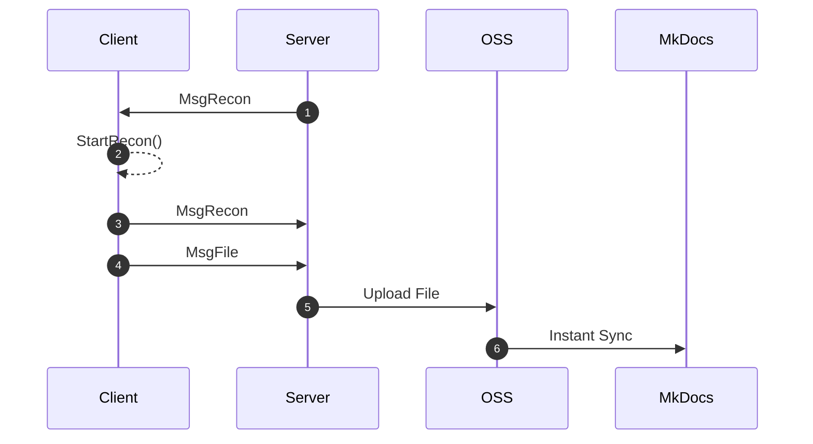

### shell

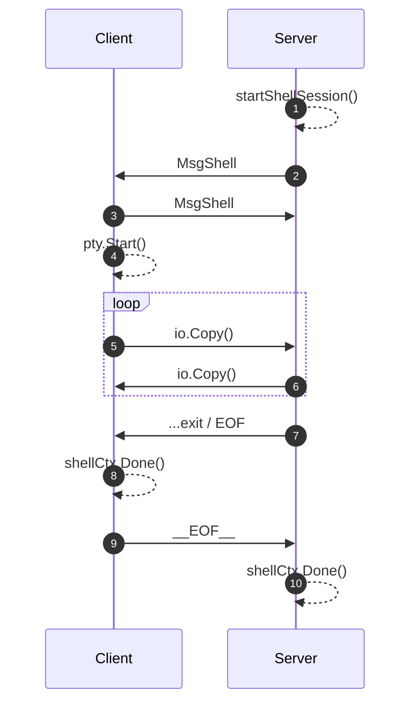

### run

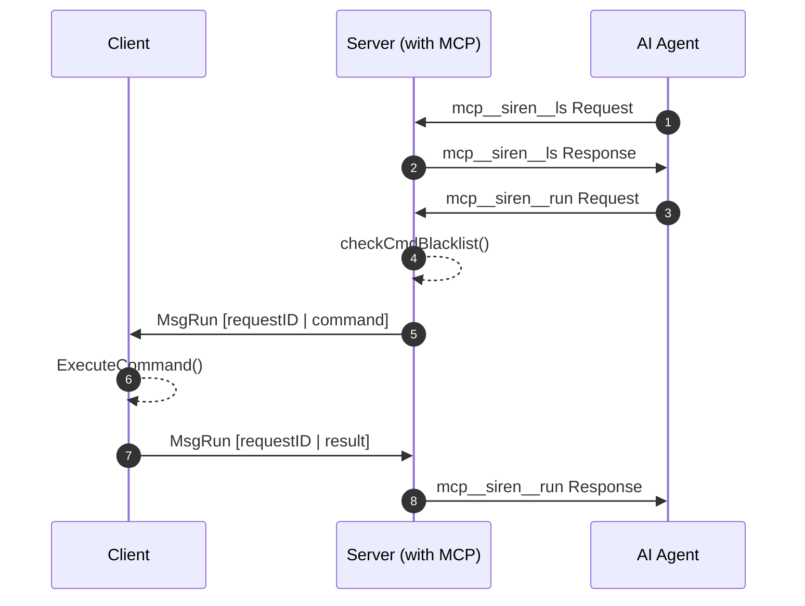

### upload

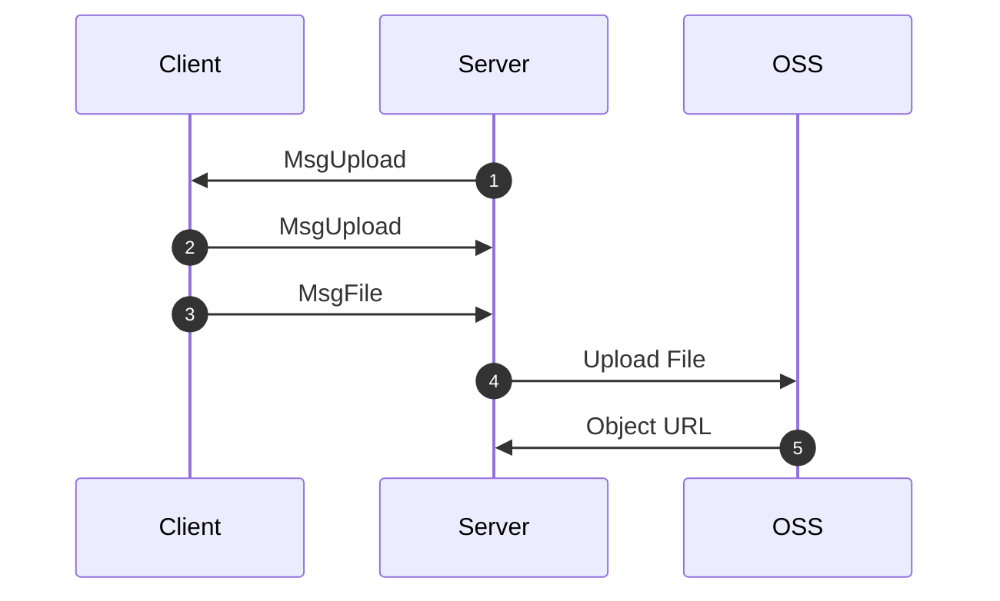

### ti

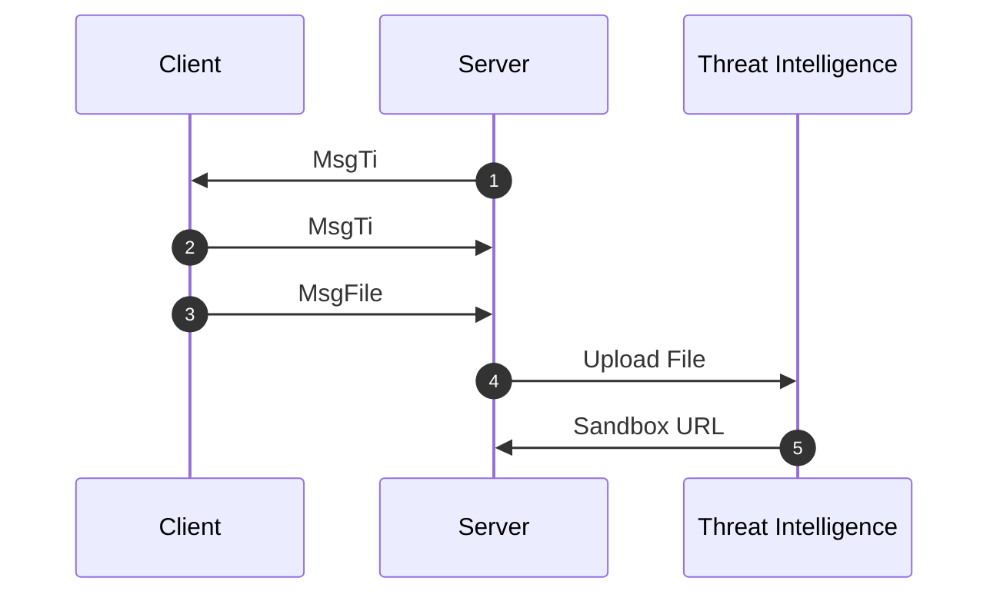

### info

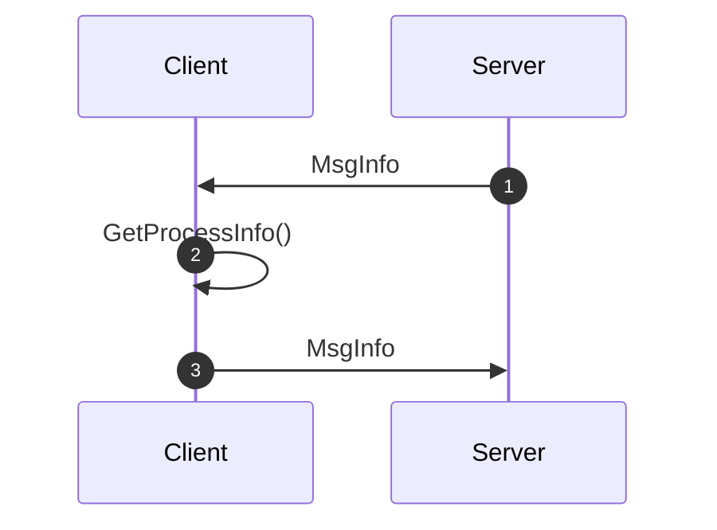

### plugins install

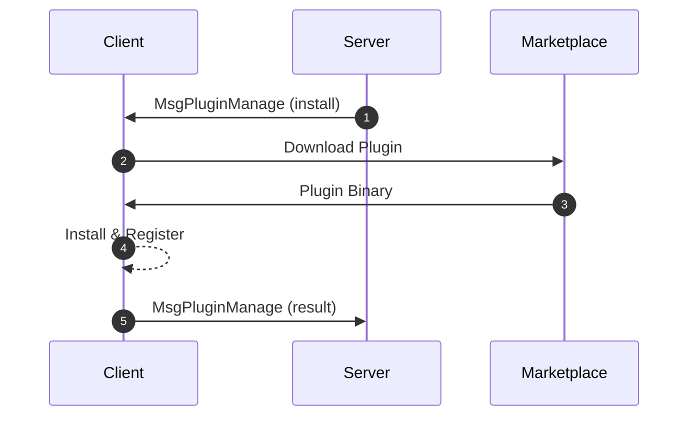

### plugin invoke (command type)

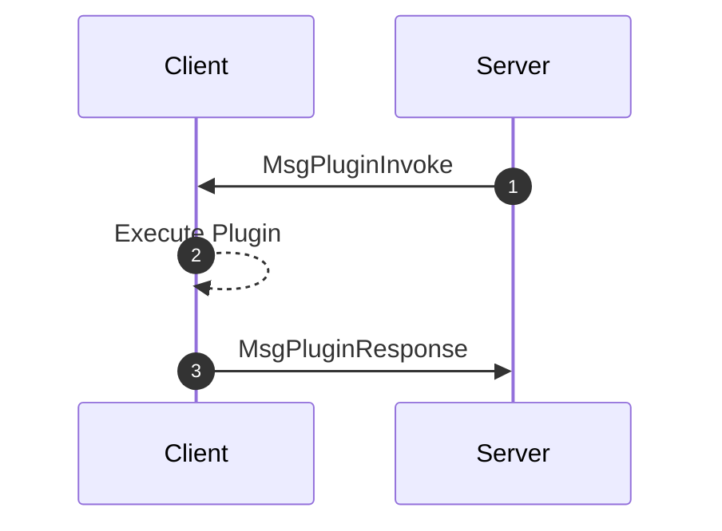

### plugin invoke (recon type)

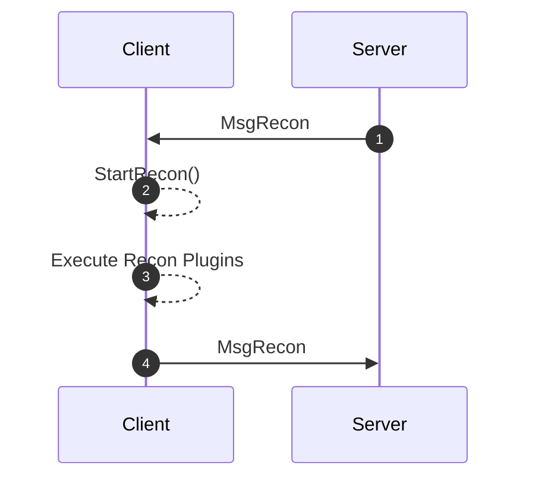

### forward / stopforward

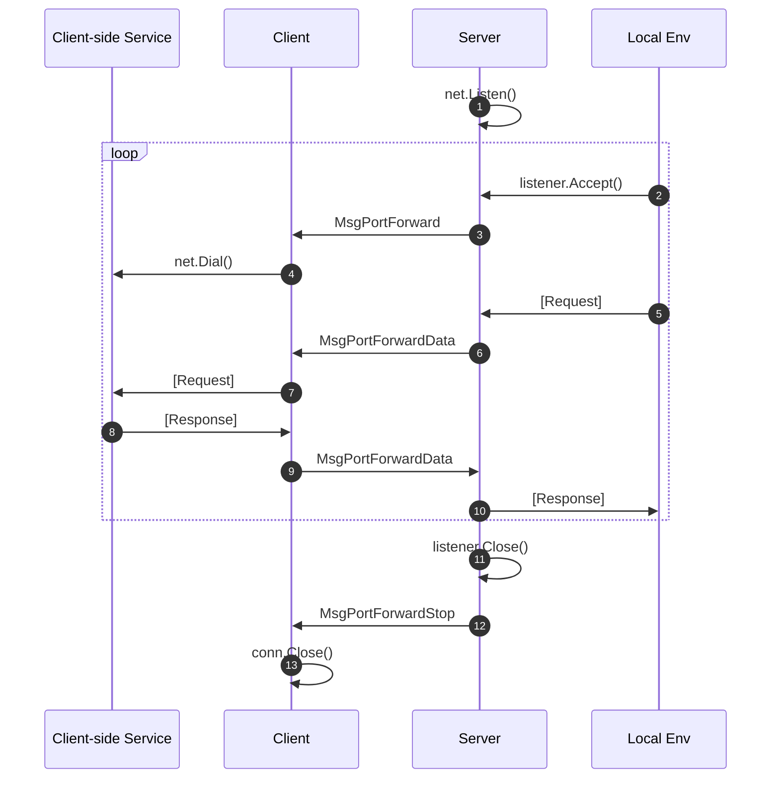

### clean

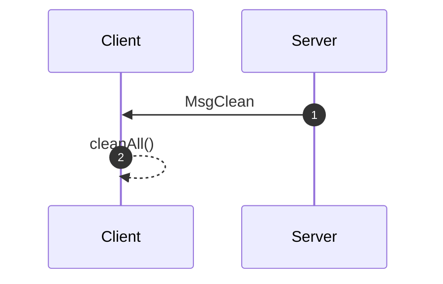
