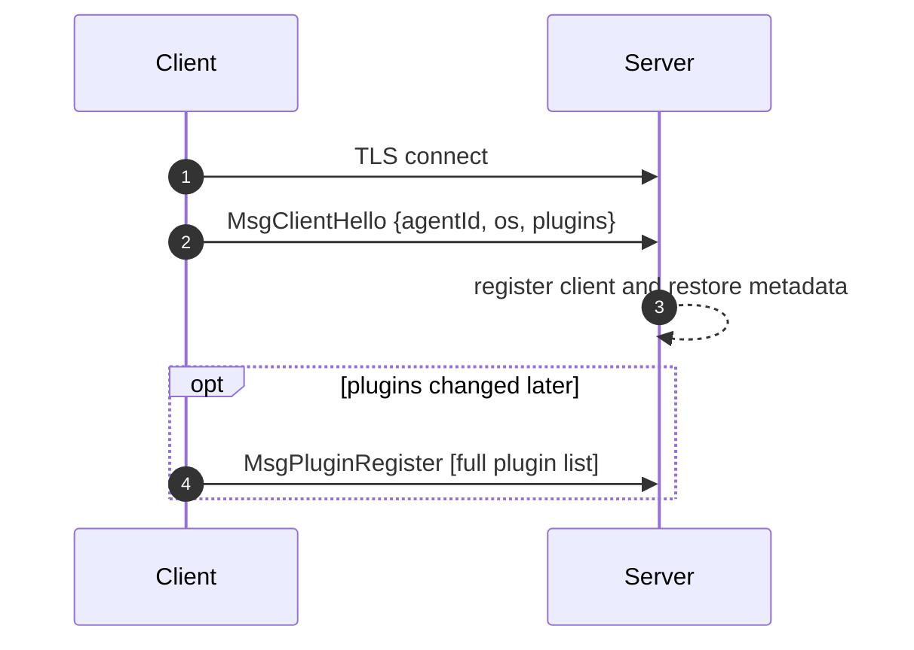
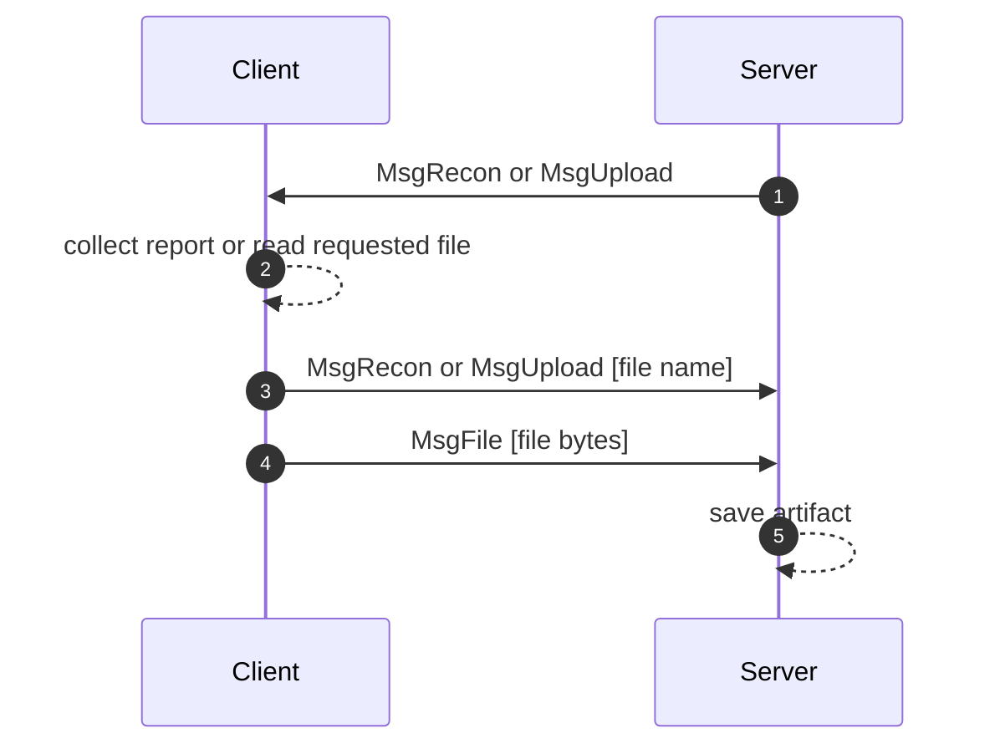
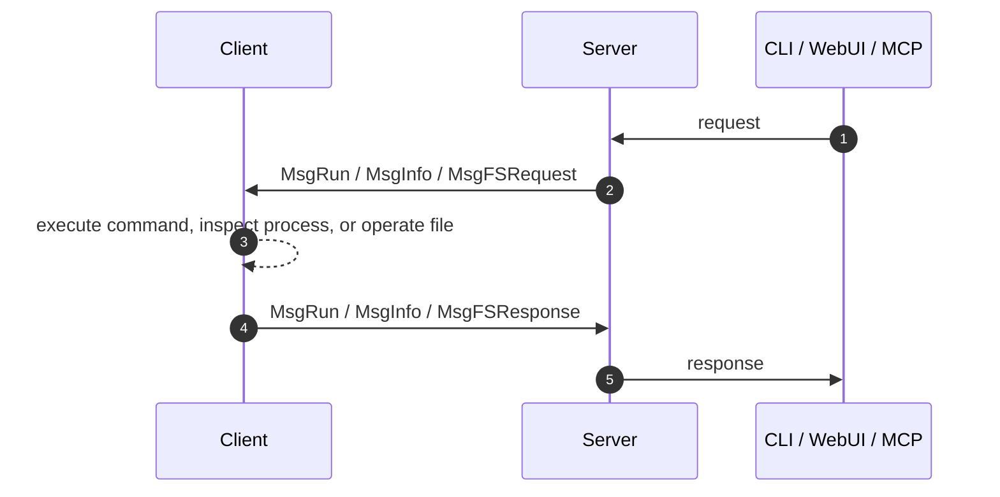
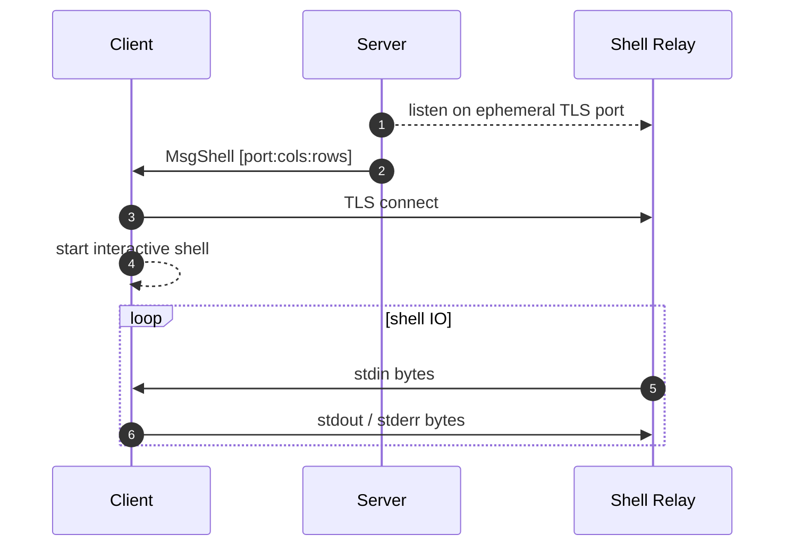
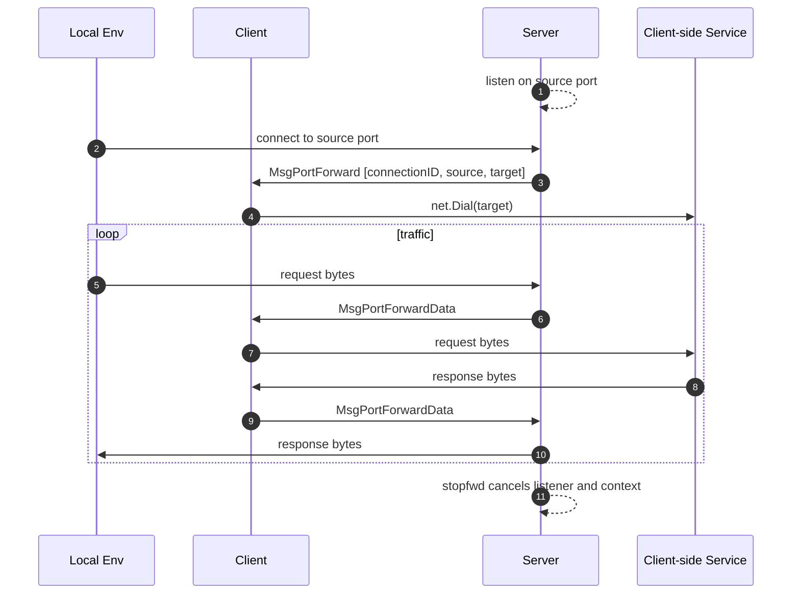
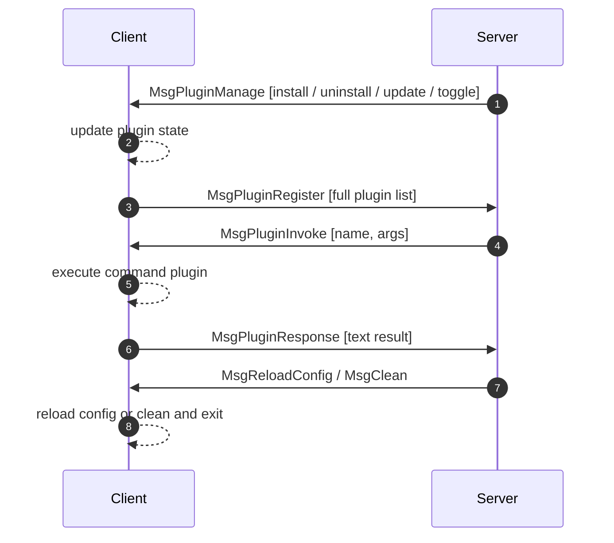

import { Callout } from "fumadocs-ui/components/callout";

<Callout title="开发参考" type="info">
  本页面面向维护 SIREN 协议、排查客户端连接和插件通信的开发者，描述的是当前实现中的内部协议，不承诺跨版本兼容。
</Callout>

## 通信通道

SIREN 客户端与服务端的主通道是 TLS TCP 连接。服务端默认监听客户端连接端口 `443`，TLS 最低版本为 1.2。WebUI 与 MCP 使用独立的 HTTP 服务，默认端口为 `8080`，不使用本页描述的帧协议。

主通道建立后，客户端必须先发送 `MsgClientHello`。服务端通过该帧完成客户端注册、恢复备注与项目归属，并缓存当前插件列表。后续插件发生安装、卸载、更新或启停变化时，客户端再通过 `MsgPluginRegister` 刷新完整插件列表。

交互式 shell 会在主通道之外临时建立一个 TLS relay 连接；端口转发的数据则继续通过主通道上的 `MsgPortForwardData` 分片传输。

## 标准帧

```go title="internal/protocol/protocol.go"
type Header struct {
	MsgType uint8
	DataLen uint64
}

type Message struct {
	Header Header
	Data   []byte
}
```

标准帧格式如下：

```text
1 byte MsgType | 8 bytes DataLen | DataLen bytes payload
```

`DataLen` 是 big-endian `uint64`。单帧 payload 最大为 `1 GiB`，超过限制会被视为不可恢复的协议错误并断开连接。`DataLen = 0` 表示没有 payload。

## Payload 约定

不同消息类型复用同一帧头，但 payload 约定不同：

| 类型 | Payload 约定 |
| --- | --- |
| `MsgClientHello`、`MsgPluginRegister`、`MsgPluginInvoke`、`MsgPluginManage`、`MsgFSRequest`、`MsgFSResponse` | JSON |
| `MsgRun` | 前 4 字节为 big-endian `requestID`，后续为命令或结果 |
| `MsgInfo` | CLI 场景可发送文本参数；WebUI/MCP 场景使用带 `requestID` 的 JSON |
| `MsgRecon`、`MsgUpload` | 第一帧为文件名，紧随其后的第二帧必须是 `MsgFile` 文件内容 |
| `MsgPortForward`、`MsgPortForwardData` | 使用固定长度字段承载连接 ID、端口、目标主机和数据分片 |
| `MsgShell` | `port:cols:rows` 文本，客户端据此连接临时 shell relay |
| `MsgClean`、`MsgReloadConfig` | 无 payload |

## 消息类型

| 消息 | 方向 | 用途 |
| --- | --- | --- |
| `MsgClientHello` | Client -> Server | 客户端上线握手，包含稳定 `agentId`、OS 和插件列表 |
| `MsgPluginRegister` | Client -> Server | 客户端插件列表变化后刷新完整列表 |
| `MsgRecon` | Server -> Client / Client -> Server | 服务端发起 recon，客户端返回报告文件名 |
| `MsgUpload` | Server -> Client / Client -> Server | 服务端请求客户端上传指定文件，客户端返回文件名 |
| `MsgFile` | Client -> Server | `recon` 或 `upload` 的文件内容帧 |
| `MsgRun` | Server -> Client / Client -> Server | 执行远程命令并返回输出 |
| `MsgInfo` | Server -> Client / Client -> Server | 查询进程、端口或进程名相关信息 |
| `MsgShell` | Server -> Client | 通知客户端连接临时 shell relay |
| `MsgPortForward` | Server -> Client | 通知客户端为一次转发连接拨号目标服务 |
| `MsgPortForwardData` | 双向 | 传输端口转发的数据分片 |
| `MsgClean` | Server -> Client | 清理客户端痕迹并退出 |
| `MsgReloadConfig` | Server -> Client | 重新加载客户端配置 |
| `MsgPluginManage` | Server -> Client | 安装、卸载、更新或切换插件 |
| `MsgPluginInvoke` | Server -> Client | 调用 command 类型插件 |
| `MsgPluginResponse` | Client -> Server | 返回插件执行结果 |
| `MsgFSRequest` | Server -> Client | WebUI 文件浏览、读取、下载或上传请求 |
| `MsgFSResponse` | Client -> Server | WebUI 文件操作响应 |

`MsgPortForwardStop` 当前仅保留为消息类型定义，现行 `stopfwd` 流程通过服务端取消转发上下文来关闭监听，不向客户端发送停止帧。

## Raw 日志

客户端完成握手后会把日志输出重定向到主连接。服务端读取客户端数据时，如果首字节不在标准消息类型范围内，会把它当作 raw 日志行读取到 `\n`，打印到终端并记录到 WebUI Recon 日志流，然后继续读取下一帧。

raw 日志单行最大为 `64 KiB`。超过限制或出现无法重新对齐帧边界的错误时，服务端会关闭当前连接。

## 错误边界

- 客户端握手帧必须是 `MsgClientHello`，且握手 payload 最大为 `64 KiB`。
- `MsgRecon` 与 `MsgUpload` 后面必须紧跟 `MsgFile`。如果第二帧类型不匹配，连接会被关闭，避免错误字节流被继续解释为协议帧。
- 超过单帧大小限制、raw 日志行过长或读取到无法识别的服务端消息时，接收方会把连接视为不可恢复。
- 除 `MsgRun`、`MsgInfo`、`MsgFSResponse`、`MsgPluginResponse`、`MsgPluginRegister` 等明确有响应消息的流程外，管理类消息通常不单独返回 ACK。

## 关键流程

### 客户端上线


```mermaid
sequenceDiagram
    autonumber
    participant C as Client
    participant S as Server
    C->>S: TLS connect
    C->>S: MsgClientHello {agentId, os, plugins}
    S-->>S: register client and restore metadata
    opt plugins changed later
        C->>S: MsgPluginRegister [full plugin list]
    end
```

### recon / upload


```mermaid
sequenceDiagram
    autonumber
    participant C as Client
    participant S as Server
    S->>C: MsgRecon or MsgUpload
    C-->>C: collect report or read requested file
    C->>S: MsgRecon or MsgUpload [file name]
    C->>S: MsgFile [file bytes]
    S-->>S: save artifact
```

`recon` 会在客户端本地执行内置检查和已启用的 recon 插件，最终把报告作为文件传回服务端。`upload` 使用同样的两帧文件边界，把客户端文件保存到服务端 `uploads/client-<id>/` 下。

### run / info / filesystem


```mermaid
sequenceDiagram
    autonumber
    participant C as Client
    participant S as Server
    participant U as CLI / WebUI / MCP
    U->>S: request
    S->>C: MsgRun / MsgInfo / MsgFSRequest
    C-->>C: execute command, inspect process, or operate file
    C->>S: MsgRun / MsgInfo / MsgFSResponse
    S->>U: response
```

`MsgRun` 与 WebUI/MCP 使用的结构化 `MsgInfo`、`MsgFSRequest` 都带有 `requestID`，服务端据此把异步响应交还给对应调用方。REPL 发起的 `run` 使用 `requestID = 0`，结果直接打印到服务端终端。

### shell


```mermaid
sequenceDiagram
    autonumber
    participant C as Client
    participant S as Server
    participant R as Shell Relay
    S-->>R: listen on ephemeral TLS port
    S->>C: MsgShell [port:cols:rows]
    C->>R: TLS connect
    C-->>C: start interactive shell
    loop shell IO
        R->>C: stdin bytes
        C->>R: stdout / stderr bytes
    end
```

`MsgShell` 只负责把 relay 端口和终端尺寸告诉客户端。真正的交互式输入输出不在主帧协议里传输，而是在临时 TLS relay 连接上直接转发。

### port forward


```mermaid
sequenceDiagram
    autonumber
    participant L as Local Env
    participant C as Client
    participant S as Server
    participant CS as Client-side Service
    S-->>S: listen on source port
    L->>S: connect to source port
    S->>C: MsgPortForward [connectionID, source, target]
    C->>CS: net.Dial(target)
    loop traffic
        L->>S: request bytes
        S->>C: MsgPortForwardData
        C->>CS: request bytes
        CS->>C: response bytes
        C->>S: MsgPortForwardData
        S->>L: response bytes
    end
    S-->>S: stopfwd cancels listener and context
```

一次本地连接对应一个 `connectionID`。双向数据都被切成 `MsgPortForwardData` 帧，payload 内带 `connectionID`，服务端和客户端各自按 ID 分发到对应 TCP 连接。

### plugins / lifecycle


```mermaid
sequenceDiagram
    autonumber
    participant C as Client
    participant S as Server
    S->>C: MsgPluginManage [install / uninstall / update / toggle]
    C-->>C: update plugin state
    C->>S: MsgPluginRegister [full plugin list]
    S->>C: MsgPluginInvoke [name, args]
    C-->>C: execute command plugin
    C->>S: MsgPluginResponse [text result]
    S->>C: MsgReloadConfig / MsgClean
    C-->>C: reload config or clean and exit
```

recon 类型插件不走 `MsgPluginInvoke`，而是在 `MsgRecon` 触发的 recon 流程中随内置检查一起执行。
