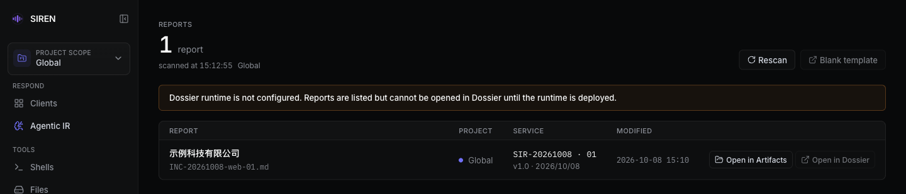

import { Callout } from "fumadocs-ui/components/callout";
import { Accordion, Accordions } from "fumadocs-ui/components/accordion";
import { Step, Steps } from "fumadocs-ui/components/steps";

SIREN 的应急响应报告是保存在 [Artifacts](/artifacts) 中的 Dossier Markdown 文件（`.md`）。WebUI 的 **Reports** 页列出这些报告，Dossier 编辑器负责编辑、校样和导出 PDF / HTML。写法见 [报告语法](/reports/syntax)。

## 前置条件

- 已 [部署 Dossier](/server/dossier)。未部署时 Reports 页仍会列出报告，但无法在 Dossier 中打开。
- 使用桌面版 Chrome 或 Edge。移动端只适合预览，不适合编辑源文件。

## 什么算一份报告

`.md` 文件开头是 `---` frontmatter，并且同时包含以下四个字段，就会出现在 Reports 页：

```md
---
date: 20261008
sir-seq: 01
version: 1.0
client: 示例客户
---
```

| 字段 | 含义 |
| --- | --- |
| `date` | 报告日期，8 位数字 |
| `sir-seq` | 服务序号，通常两位，首次交付写 `01` |
| `version` | 报告版本，如 `1.0` |
| `client` | 客户名称，Reports 页以它作为报告标题 |

frontmatter 必须从文件第一行开始（允许 UTF-8 BOM）。Recon 生成的 `.md` 和普通笔记没有这组字段，不会列出。只有 `.md` 文件能在 Dossier 中编辑，`.markdown` 文件只能在 Artifacts 中预览。

## 创建报告

WebUI 不能新建文件。报告通过以下途径进入 Artifacts：

- **由 AIR 生成**：Agent 在会话工作目录中写出报告后，该轮末尾会出现 **Report** 卡，点击 **Edit in Dossier** 继续编辑，见 [Report 卡](/air/gui#report-卡)。
- **上传已有报告**：在 [Artifacts](/artifacts#文件操作) 中把 `.md` 上传到目标目录，再从 Reports 页或 Artifacts 打开。
- **从空白模板起草**：在 Reports 页点击 **Blank template**，在打开的模板中编辑后，用工具栏 **导出** → **MD** 下载源文件，再上传到 Artifacts。模板本身不能保存。

<Callout title="不要在 Blank template 中粘贴图片" type="warn">
  模板虽然只读，但其中粘贴的图片会立即写入 Dossier 目录下的 `report.assets/pasted/`。这个目录不需要登录即可访问，也不属于任何报告，见 [`/dossier/` 不鉴权](/server/security#dossier-不鉴权)。先把报告上传到 Artifacts，从 Artifacts 打开后再粘贴截图。
</Callout>

## Reports 页



Reports 页的扫描范围随当前范围变化：

| 范围 | 扫描目录 | 表格 |
| --- | --- | --- |
| Global | 服务端工作目录和所有 Project 目录 | 多出 **Project** 列，标明报告所属 Project |
| Project | 该 Project 的目录 | 只列该 Project 的报告 |

表格列：

- **Report**：`client` 字段值和文件路径。`client` 为空时依次改用封面 `cover-hero` 中的 `title`、文件名。
- **Service**：服务编号 `SIR-<date> · <sir-seq>`，下方是版本和日期。
- **Modified**：文件修改时间。

报告按 `date` 从新到旧排列，日期相同的按修改时间排列。每行末尾有两个按钮：

- **Open in Artifacts**：切换到报告所属范围，在 Artifacts 中选中该文件。
- **Open in Dossier**：在新标签页用 Dossier 编辑该报告。Dossier 不可用时按钮置灰，悬停可见原因。

页面右上角：

- **Rescan**：重新扫描。每个范围只在首次进入时自动扫描一次，之后新增或修改的报告需要点 **Rescan** 才会出现。
- **Blank template**：在新标签页以只读方式打开 Dossier 自带的空白模板。

扫描规则：

- 跳过以 `.` 开头的目录和文件、符号链接、`node_modules`、`*.assets` 附件目录，以及 `webui.dossierDir`（即使它位于工作目录或 Project 目录内，其中的模板 `report.md` 也不会被列为报告）。
- 只向下扫描 5 层子目录，每个根目录最多检查 20000 个条目。达到上限时，页面顶部显示 **partial scan**，更深的报告可能缺失。
- 超过 10 MiB 的 `.md` 文件不会列出。

## 在 Dossier 中编辑

<Steps>
<Step>

### 打开报告

从以下任一入口打开，Dossier 都会在新标签页中加载这份文件，保存时写回原位置：

- Reports 页的 **Open in Dossier**
- Artifacts 中选中 `.md` 后的 **Dossier** 按钮
- AIR Report 卡的 **Edit in Dossier**

</Step>
<Step>

### 编辑源文件

左侧是源码面板，右侧实时渲染 A4 报告预览。拖动源码面板右边缘可以调整宽度，双击恢复默认。源码面板底部：

- 文件名后出现 ` *` 表示有未写回服务端的修改。
- **待填** 显示还有多少处模板占位（如 `[ 客户名称 ]`）未替换，点击跳到下一处。
- **目录** 打开报告大纲。
- **跳到错误** 在有解析错误时出现，点击跳到下一处错误。

</Step>
<Step>

### 校样

打开工具栏 **校样**，预览会按导出 PDF 的真实页高裁切，内容溢出的页面以橙色标出。修完后关闭校样，回到可以完整显示溢出内容的编辑视图。

</Step>
<Step>

### 保存

点击 **保存** 或按 `⌘S` / `Ctrl+S`，源文件写回服务端，文件名后的 ` *` 消失。在有未保存修改时关闭或刷新页面，浏览器会先弹出确认。

</Step>
<Step>

### 导出

在 **导出** 菜单中选择格式，见下文 [导出](#导出)。

</Step>
</Steps>

### 工具栏

| 按钮 | 作用 |
| --- | --- |
| **文件** | **新建** / **打开** 本地文件。在 SIREN 中不可用，报告从 Artifacts 或 Reports 打开 |
| **保存** | 写回服务端，快捷键 `⌘S` / `Ctrl+S` |
| **源** | 显示或隐藏源码面板，`Esc` 关闭 |
| **草稿** | 有浏览器草稿时出现，显示草稿时间；**放弃** 丢弃草稿并重新加载服务端上的版本 |
| **校样** | 按 PDF 真实分页裁切预览 |
| **导出** | **PDF**、**HTML**、**MD** |
| **帮助** | 语法指南、快捷键、结构块模板、查找替换和解析诊断说明 |

### 保存失败

保存只有在 SIREN 明确返回成功时才算完成。以下情况会在源码面板底部显示失败原因，修改仍保留在编辑器和浏览器草稿中：

- **登录过期**：提示 SIREN 登录已过期。回到 WebUI 重新登录后，再在 Dossier 中保存。
- **15 秒内无响应**：提示保存超时，稍后重试。
- **反向代理返回了登录页或其他非预期响应**：按失败处理，不会误报成功。只代理 `/dossier/` 时常见，见 [部署 Dossier](/server/dossier#注意事项)。
- **Blank template**：模板只读，保存返回 HTTP 403。
- **报告加载失败**：文件读取失败，或文件中没有任何 `##` 章节时，Dossier 显示内置模板作为只读预览，并阻止保存，避免覆盖原文件。修正文件后重新打开。

## 粘贴图片

在源码面板中粘贴图片，或把图片文件拖进源码面板，Dossier 会把图片上传到报告同目录的附件目录，并在光标处插入引用：

```text
IR-20261008-01.md
IR-20261008-01.assets/pasted/paste-20261008-143000-123456789.png
```

```md
{caption=""}
```

在 `caption=""` 中填写图注，不需要图注时删掉这个属性。

- 只接受 PNG、JPEG、WebP 和 GIF，单张不超过 100 MiB，上传 45 秒内未完成按失败处理。
- 在 SIREN 中，报告引用的本地图片必须位于 `<报告名>.assets/` 目录内，其他位置的图片无法显示。手工放入的截图也应放到这个目录。
- 图片上传完成前导出会等待；上传失败时导出取消。

## 浏览器草稿

编辑内容会自动保存到浏览器的 IndexedDB，用于防止页面崩溃或误关时丢失修改，不替代 **保存**：

- 重新打开同一份报告时，只要草稿与服务端文件内容不同，就会自动加载草稿，工具栏显示 **草稿** 和保存时间。草稿与服务端文件相同时直接丢弃，保存成功后草稿也会清除。
- 草稿不会检查服务端文件是否已被他人修改。看到 **草稿** 标记但不确定内容是否最新时，点 **放弃** 回到服务端版本。
- 每个浏览器只保留一份草稿。编辑另一份报告后，前一份报告的草稿会被覆盖，切换报告前先保存。
- 草稿写入失败（例如浏览器存储空间不足）时，工具栏的草稿标记变红并显示原因。

## 导出

| 格式 | 结果 |
| --- | --- |
| **PDF** | 打开浏览器打印对话框，选择 “保存为 PDF”。文件名默认为 `<client>-安全事件应急响应报告-<date>-<sir-seq>` |
| **HTML** | 下载单文件 HTML 留档，内嵌本报告用到的图片和字体子集。快照本身仍可编辑，但不含源码中的 HTML 注释 |
| **MD** | 下载当前源文件，保留 HTML 注释 |

导出前 Dossier 会检查报告是否就绪，以下情况会中止导出并提示原因：

- 源文件仍有解析错误。
- 图片仍在上传或上传失败。
- 图片或字体加载失败，或图片、字体 30 秒内未加载完成。
- 报告引用了当前报告附件以外的图片。
- 分页尚未完成，或导出准备期间内容又被修改。
- 导出 HTML 时，服务端上的 Dossier 已更新为新版本。刷新页面后重新导出。

导出 PDF 时如果还有未填写的模板占位，会先弹窗确认。PDF 是交付件，导出前先 **保存**，并在 **校样** 模式下检查溢出、图片尺寸和分页。

## 文件限制

| 项目 | 限制 |
| --- | --- |
| 报告文件类型 | 只有 `.md` 可以在 Dossier 中编辑 |
| 报告源文件大小 | 不超过 10 MiB，超过时无法打开，也不会出现在 Reports 页 |
| 粘贴图片 | PNG、JPEG、WebP、GIF，单张不超过 100 MiB |
| 图片位置 | 必须位于 `<报告名>.assets/` 目录内 |
| Blank template | 只读，不能保存 |

## 离线使用

Dossier 也可以脱离 SIREN 在本地使用，适合交给其他报告作者或在无网络环境中写作，见 [本地离线使用](/server/dossier#本地离线使用)。本地使用时，首次保存会要求选择 `.md` 的写入位置；首次粘贴图片会要求选择包含 `index.html` 的 Dossier 目录，图片写入其中的 `assets/pasted/`。

## 常见问题

<Accordions>
<Accordion title="报告没有出现在 Reports 页">
确认文件以 `.md` 结尾、不超过 10 MiB，frontmatter 从第一行开始且四个字段齐全，所在目录不以 `.` 开头、不在 `*.assets` 或 `node_modules` 中，深度不超过 5 层子目录。然后点击 **Rescan**。在 Global 视图中，Project 目录中的报告列在对应 Project 下。
</Accordion>
<Accordion title="Open in Dossier 和 Blank template 是灰的">
Dossier 未部署或路径配置错误时，页面顶部会显示提示，**Open in Dossier** 和 **Blank template** 都不可点击；只缺默认模板时只有 **Blank template** 不可点击。悬停按钮可见原因，排查见 [部署 Dossier](/server/dossier#验证)。
</Accordion>
<Accordion title="Dossier 打开后显示的是模板，不是我的报告">
报告加载失败，或文件里没有任何 `##` 章节。Dossier 会显示内置模板作为只读预览并阻止保存。检查文件内容后从 Artifacts 重新打开。
</Accordion>
<Accordion title="Artifacts 中没有 Dossier 按钮">
只有 `.md` 文件显示 **Dossier** 按钮，`.markdown` 只能预览。
</Accordion>
<Accordion title="报告中的图片显示不出来">
SIREN 中只能显示 `<报告名>.assets/` 目录内的 PNG、JPEG、WebP、GIF 图片。把图片移到该目录并修改引用路径，或直接在编辑器中重新粘贴。
</Accordion>
</Accordions>
