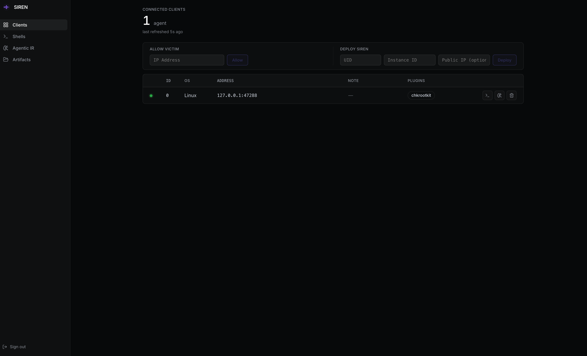
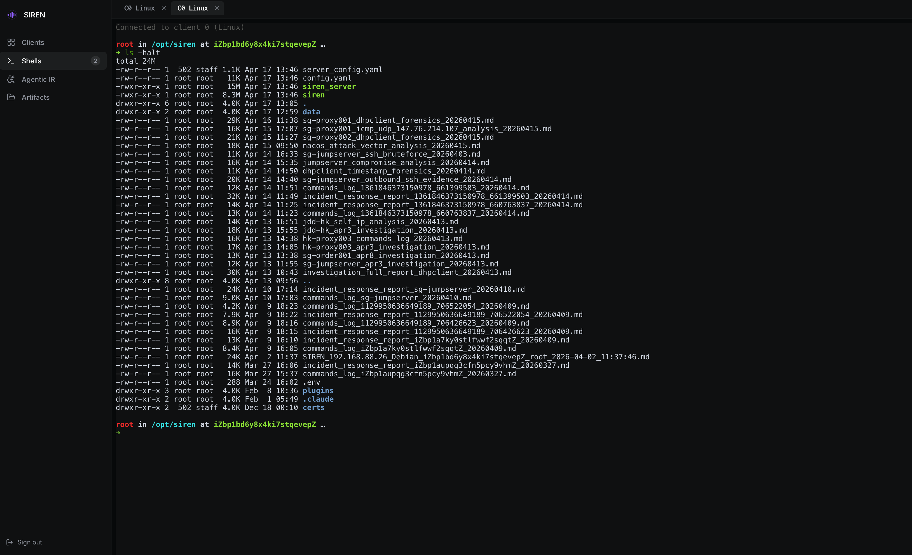
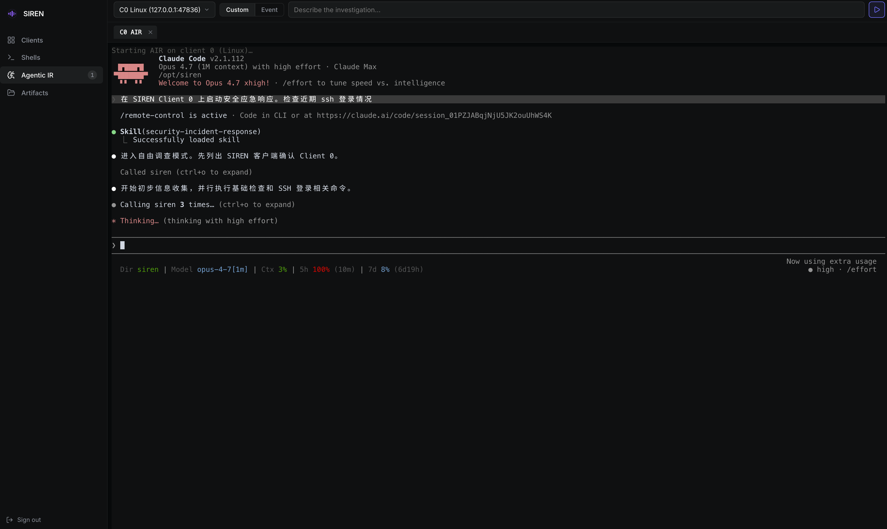
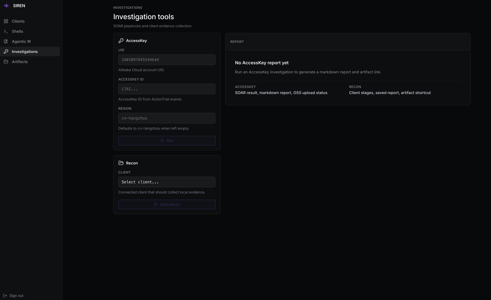
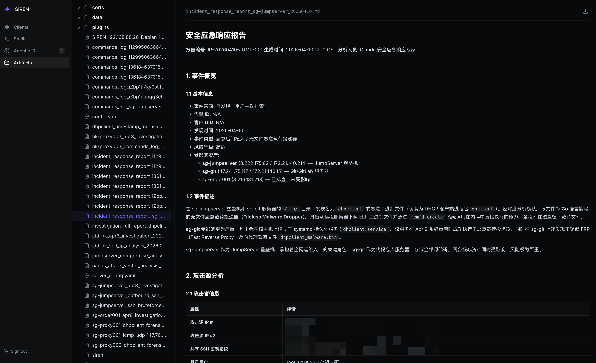

import { Banner } from 'fumadocs-ui/components/banner';
import { Callout } from "fumadocs-ui/components/callout";
import { Card, Cards } from "fumadocs-ui/components/card";
import { Step, Steps } from "fumadocs-ui/components/steps";
import { Accordion, Accordions } from "fumadocs-ui/components/accordion";
import { Users, Terminal, Brain, FolderTree, Lock, Plug, Key } from 'lucide-react';

<Banner changeLayout={false} variant="rainbow" rainbowColors={['#60a5fa']}>仅远程模式支持</Banner>

SIREN 服务端内置 Web 控制台，提供所有远程模式功能的图形化入口。无需登录控制主机、无需 tmux 操作，通过浏览器即可完成客户端管理、交互式 Shell、Agentic 应急响应、SOAR 命令调用以及取证文件浏览。

## 启动与访问

WebUI 随 `siren_server` 自动启动，默认监听 `0.0.0.0:8080`。

```bash title="控制主机"
./siren_server
```

启动后访问：

```
http://<SIREN Server IP>:8080
```

<Callout title="端口统一" type="info">
  从 v2.0.0 起，WebUI 与 [MCP 服务](/mcp) 共享同一端口（默认 `8080`）。MCP 客户端通过 `/mcp` 子路径访问，WebUI 通过根路径访问。
</Callout>

## 账号鉴权

WebUI 使用基于 Session Cookie 的账号鉴权机制，密码通过 bcrypt 哈希后存储在 SQLite 数据库（默认 `data/users.db`）。

<Callout title="安全注意" type="warn">
  当用户数据库**不存在**或**没有任何用户**时，WebUI 会自动禁用鉴权、允许匿名访问。部署到公网前务必先创建至少一个用户。
</Callout>

### 管理用户账号

<Steps>
<Step>

### 创建账号

```bash title="控制主机"
./siren_server user add <username>
```

执行后会提示输入密码两次。密码 bcrypt 哈希后写入 `data/users.db`。

</Step>
<Step>

### 列出账号

```bash title="控制主机"
./siren_server user list
```

</Step>
<Step>

### 删除账号

```bash title="控制主机"
./siren_server user delete <username>
```

</Step>
</Steps>

<Callout title="数据库路径一致性" type="info">
  `data/users.db` 默认相对**当前工作目录**解析。如果 `siren_server user add` 与 `siren_server` 在不同目录启动，会写入/读取不同的数据库，导致鉴权失效。建议在 `server_config.yaml` 中显式配置绝对路径：

  ```yaml
  webui:
    userDBPath: /opt/siren/data/users.db
  ```

  或者在 systemd unit 中设置 `WorkingDirectory`。
</Callout>

## 功能页面

<Cards>
  <Card title="Clients" icon={<Users />}>客户端列表、在线状态、备注编辑、SOAR 放行/部署、清理痕迹</Card>
  <Card title="Shells" icon={<Terminal />}>多标签交互式终端，切换页面会话不中断</Card>
  <Card title="Agentic IR" icon={<Brain />}>在浏览器中启动 AI Agent 自动化应急响应</Card>
  <Card title="Investigations" icon={<Key />}>AccessKey 调查、客户端 Recon、阶段进度与报告入口</Card>
  <Card title="Artifacts" icon={<FolderTree />}>取证文件浏览，支持 Markdown 预览、二进制识别、文件下载</Card>
</Cards>

### Clients



等价于服务端 REPL 的 `ls`、`note`、`allow`、`deploy`、`clean` 命令。每行展示一个客户端，支持：

- **备注编辑**：点击备注直接在行内修改
- **放行**（allow）：调用 SOAR 将受害主机出口 IP 加入安全组白名单
- **部署**（deploy）：通过云助手一键部署 SIREN 客户端
- **清理**（clean）：远程清除受害主机上的 SIREN 痕迹（带二次确认）

### Shells



每个客户端可开启多个终端标签。底层通过 WebSocket 桥接到服务端，服务端再以 TLS 转发到受害主机 PTY。切换到其他页面（Clients/AIR/Artifacts）时 Shell 会话保持活动，回到 Shells 页可继续输入。

### Agentic IR



等价于服务端 REPL 的 `air` 命令，在浏览器里启动 AI Agent 完成 [Agentic 应急响应](/air)。选择目标客户端后可选两种模式：

- **事件模式**：输入阿里云 UID + 安全中心 Event ID，自动拉取告警详情
- **自定义 Prompt**：自由输入应急响应指令

Agent 在服务端本地 PTY 里运行，输出流式推送到浏览器。

### Investigations



Investigations 页面用于承载需要等待结果的调查工具，目前包含 AccessKey 调查和客户端 Recon。

- **AccessKey**：输入 Alibaba Cloud UID、AccessKey ID 与 Region 后，服务端调用现有 SOAR 剧本生成 Markdown 报告。WebUI 只展示真实的 playbook 运行状态，完成后可直接打开 Artifacts 查看报告。
- **Recon**：选择在线客户端并下发信息收集命令。页面展示服务端从客户端日志中解析出的阶段列表，例如 `Recon.Basic`、`Recon.User`、`Recon.Process`、`Upload report to OSS`，不再暴露原始彩色日志。
- **报告入口**：调查结束后会显示 Open Artifacts 按钮，直接跳转到生成的报告文件；报告也会保留在服务端工作目录中，方便远程部署环境查看。

<Callout title="进度展示原则" type="info">
  WebUI 只展示服务端能真实观测到的阶段。AccessKey 调查的 SOAR 子步骤不可见，因此只显示 playbook 正在运行；Recon 阶段来自客户端实际回传日志。
</Callout>

### Artifacts



浏览服务端工作目录下的文件，典型使用场景是查看 [信息收集报告](/recon#查看数据)。特性：

- **文件树可拖拽**：拖动树与预览之间的分隔条调整宽度（180–600 px），宽度持久化到 localStorage
- **Markdown 渲染**：`.md` / `.markdown` 自动渲染
- **Markdown 悬浮目录**：包含多个标题的 Markdown 报告会自动生成 TOC，点击目录项跳转到对应章节
- **HTML 报告预览**：`.html` 文件直接在沙箱 iframe 内渲染，可正常加载同目录下的 CSS、JS、字体、图片等相对资源，适合查看 [Agentic IR](/air) 等生成的报告
- **二进制识别**：非文本文件显示"不支持预览"提示，不会报错
- **文件下载**：任意文件可通过右上角下载按钮下载
- **目录打包下载**：鼠标悬停文件树中的目录行，点击下载图标即可以 `tar.gz` 流式下载整个目录，自动排除点号开头的文件和子目录
- **隐藏文件保护**：`.env`、`.ssh` 等点号开头的文件既不列出也不允许直接访问，避免敏感信息泄露

## 配置

在 `server_config.yaml` 的 `webui` 段落配置：

```yaml title="server_config.yaml"
webui:
  enabled: true                         # 是否启用 WebUI
  listen: 0.0.0.0                       # 监听地址
  port: 8080                            # 监听端口（与 MCP 共享）
  userDBPath: /opt/siren/data/users.db  # 可选：用户数据库绝对路径
```

详见 [配置文件](/config#服务端配置)。

## 生产部署建议

<Callout title="公网暴露场景" type="warn">
  WebUI 本身使用 HTTP（非 TLS），Session Cookie 虽然是 `HttpOnly`，但在公网环境下明文传输仍有风险。强烈建议：

  - 将 WebUI 继续绑定到 `127.0.0.1`，前置 Nginx / Caddy 做 TLS 终止和反向代理
  - 或至少通过 iptables / 安全组限制访问 IP
  - 部署前必须已创建至少一个用户账号（否则 WebUI 零鉴权）
</Callout>

## 相关内容

<Cards>
  <Card title="MCP 集成" icon={<Plug />} href="/mcp">
    WebUI 与 MCP 共享同一端口的架构说明
  </Card>
  <Card title="配置文件" icon={<Lock />} href="/config#服务端配置">
    完整的 WebUI 配置项说明
  </Card>
  <Card title="Agentic 应急响应" icon={<Brain />} href="/air">
    了解 AIR 的完整工作流
  </Card>
</Cards>
