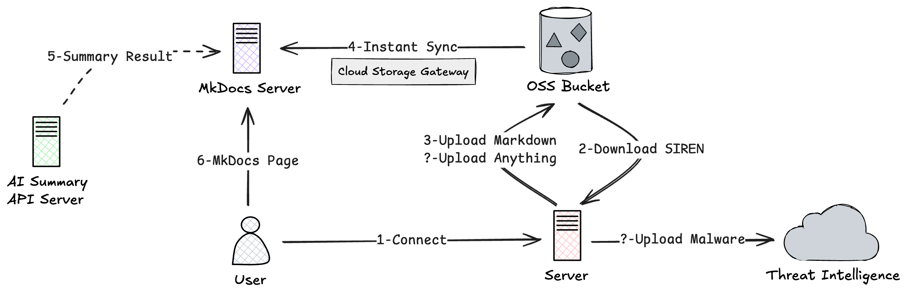
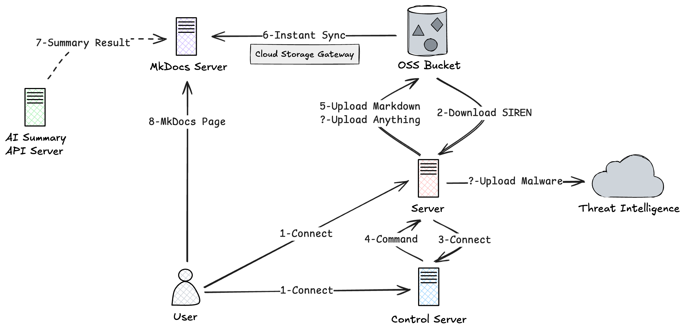

import { Card, Cards } from "fumadocs-ui/components/card";
import { Callout } from "fumadocs-ui/components/callout";
import { Search, Radio, Brain, Shield, Feather, Zap, Globe, Puzzle } from 'lucide-react';

<Callout title="注意" type="warn">
  此工具专为合法的应急响应和安全分析目的而设计。所有侦察和系统访问功能均面向有权调查受损系统的授权安全专业人员。
</Callout>

## 什么是 SIREN？

SIREN (**S**wift **I**ncident **R**esponse **E**vidence **N**avigator) 是新一代基于 Go 语言的智能化应急响应工具，通过自动化技术简化安全调查流程。它将传统的证据收集与现代 AI 驱动分析和自动化部署能力相结合，使安全专业人员能够在云环境和本地环境中快速响应安全事件。

该工具支持本地和远程两种操作模式，与 SOAR 平台无缝集成，实现自动化受害主机访问控制和客户端部署。无论是调查单个受损主机还是协调多系统响应，SIREN 都能提供有效应急响应所需的速度和智能。

## 设计理念

<Cards>
  <Card title="零依赖" icon={<Feather />}>
    Go 静态编译的单一二进制文件，无需 Python、Java 等运行时环境，开箱即用
  </Card>
  <Card title="速度优先" icon={<Zap />}>
    信息收集全流程可在数十秒内完成，每条命令均有超时控制，避免挂起
  </Card>
  <Card title="跨平台" icon={<Globe />}>
    同时支持 Linux 和 Windows，通过构建标签实现平台隔离，一套代码覆盖主流操作系统
  </Card>
  <Card title="可扩展" icon={<Puzzle />}>
    插件系统支持自定义命令和信息收集模块，无需修改核心代码即可扩展能力
  </Card>
</Cards>

## 核心能力

<Cards>
  <Card title="信息收集" icon={<Search />} href="/recon">
    自动化采集系统信息、用户、进程、网络、计划任务、服务、文件、Rootkit、Webshell 等关键数据，生成结构化 Markdown 报告
  </Card>
  <Card title="远程操作" icon={<Radio />} href="/remote">
    TLS 加密的客户端-服务端通信，支持全交互式 Shell、远程命令执行、端口转发等
  </Card>
  <Card title="智能应急" icon={<Brain />} href="/air">
    AI 驱动的自动化应急响应：MCP 集成、Agentic IR 工作流、自动生成应急响应报告
  </Card>
  <Card title="云原生集成" icon={<Shield />} href="/infra">
    SOAR 平台集成实现一键部署、AccessKey 调查、安全告警详情获取；OSS 集成实现证据留存和数据展示
  </Card>
</Cards>

## 架构设计

### 本地模式

在受害主机上直接运行 SIREN 客户端，所有数据采集和分析均在本地完成。

### 远程模式

客户端通过 TLS 加密通道连接服务端，支持多客户端统一管理、远程 Shell、端口转发、AI 驱动的应急响应等高级功能。

