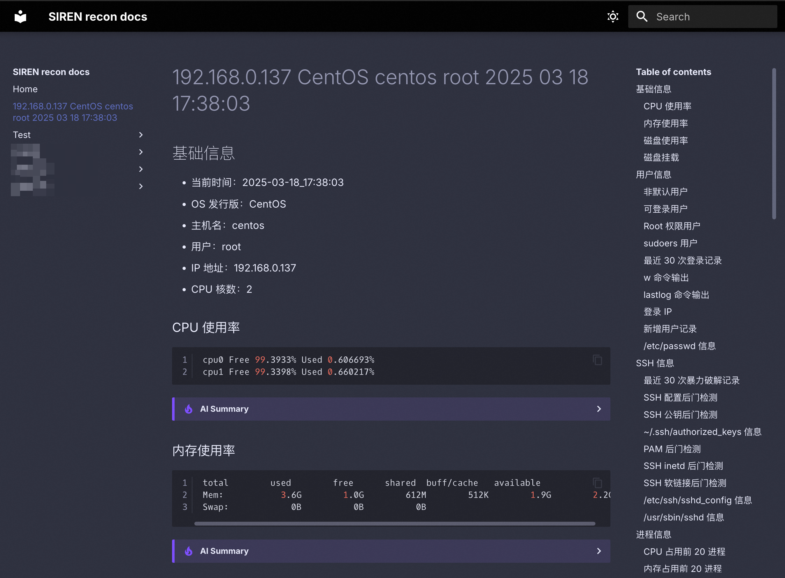

import { Callout } from "fumadocs-ui/components/callout";
import { Card, Cards } from "fumadocs-ui/components/card";
import { Step, Steps } from "fumadocs-ui/components/steps";

<Steps>
<Step>

### 设置 OSS 访问凭证（可选）

如果希望将信息收集结果上传到 OSS 并自动在 MkDocs 中展示，需要在运行前[设置 OSS 访问凭证](/credential#设置-oss-访问凭证)。

</Step>
<Step>

### 开始自动化信息收集

```bash tab="本地模式"
./siren recon
```

```bash tab="远程模式"
>>> recon <Client ID>
```

信息收集过程中执行的每一条命令默认均有 30s 超时时间（可通过[配置文件](/config#客户端配置)调整）。收集完成后，会在同目录下保存一份 Markdown 文件。如已配置 OSS 访问凭证，该文件会自动上传至 OSS。

</Step>
<Step>

### 查看数据

<Callout title="关于数据展示" type="info">
  自动 MkDocs 展示功能需自行设置基础设施，详见[关联基础设施](/infra)。
</Callout>

输出的 Markdown 可使用任何 Markdown 阅读器/编辑器打开，同时内部环境也提供 [MkDocs 站点](http://8.217.46.101:8000/) 方便阅读和查阅输出结果：



建议使用右上角搜索框对信息进行检索。此外，可以点击 AI Summary 展开折叠块，对于该小节内容进行 AI 分析（仅供参考，注意幻觉问题）：


<Callout title="文档同步延迟" type="info">
  内部环境中，文档可能需要一小段时间同步到服务器以在 MkDocs 中展示，通常不超过 1 分钟。
</Callout>

</Step>
</Steps>

## 相关内容

<Cards>
  <Card title="功能特性-信息收集" href="/features#-信息收集">
    了解 SIREN 的自动化信息收集功能特性
  </Card>
  <Card title="SIREN 概述-架构设计" href="/overview#架构设计">
    了解 SIREN 的架构设计
  </Card>
</Cards>
